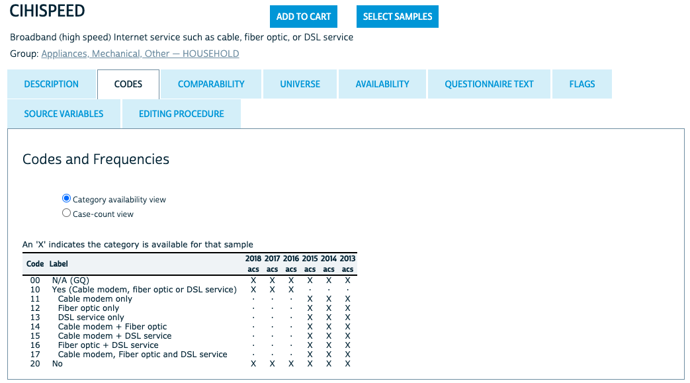

# Introduction

This post is a start to finish descriptive analysis of high speed internet access in Kentucky, including tables, graphs, and maps. All of the detail of cleaning the data and iterating while exploring the data is included. This makes for a rather lengthy post, but it also makes it relatively unique in including all of those steps. We go through five attempts at making a table of high speed internet before finally getting it right! There's quite a bit of cleaning work and then also a detour into calculating standard errors via bootstrap so we can correctly display uncertainty in our visuals.  

Census microdata is individual level data provided by the census. Most references to census data refer to tables the census bureau has already made out of their surveys, but the mostly raw survey data is available at the individual level, and that's what we'll use for this analysis. While the focus is on the census data, I do show the code used for analysis. I did decide to hide the code used to make all the tables (it gets rather lengthy), but you can see that code [on Github](https://github.com/natekratzer/personal_site/blob/more_posts/content/post/internet_census_microdata/index.Rmd) if interested. 

# Getting the Data

The easiest way to get census microdata is through the Integrated Public Use Microdata Series (IPUMS) hosted by the University of Minnesota. While you can get the data directly from the Census Bureau, IPUMS has made it much easier to compare across multiple years and to select the variables you want. IPUMS also provides a codebook that is easy to refer to and notes any important changes from year to year. 

I've put the data for just Kentucky up on GitHub, so I'll read it in from there.

```{r, message = FALSE, warning = FALSE}
library(tidyverse) #data manipulation
library(gt) #formatting tables for display
library(survey) #survey data
library(rgdal) #shapefiles for maps
library(sf) #maps

df <- read_csv("https://raw.github.com/natekratzer/raw_data/master/ky_high_speed_internet.csv")
```

# Cleaning the Data

When downloading the data it's all numeric, even for variables that are categorial - they've been coded and our first step in the analysis will be using the code book to translate them. I won't show all the codebooks, but for this first variable let's take a look at what IPUMS has to say. For all years NA is coded as 00 and No high speed internet is coded as 20. Prior to 2016 there are detailed codes for the type of internet access, while for 2016 and after the code is collapsed. 



I'll use a `case_when()` statement to recode high speed interent access into a categorical variable.

```{r}
# High Speed Internet
df <- df %>%
  mutate(
    hspd_int = case_when(
      CIHISPEED == 00 ~ NA_character_,
      CIHISPEED == 20 ~ "No",
      CIHISPEED >= 10 & CIHISPEED < 20 ~ "Yes",
      TRUE ~ NA_character_
    )
  )
```

## Getting wrong answers by not knowing the data

Now that we have a high speed internet category we can group the data and count up how many responses are in each group. I'll also pivot the dataframe to make it easy to calculate percent with high speed internet. 

```{r}
# Count numbers with and without high speed internet
df_group <- df %>%
  group_by(hspd_int, YEAR) %>%
  summarize(count = n(), .groups = "drop")

# Pivot for easier percent calculations
df_wide <- df_group  %>%
  pivot_wider(id_cols = YEAR,
              names_from = hspd_int,
              values_from = count) %>%
  mutate(
    percent_hspd = (Yes / (Yes + No)),
    percent_no = 1 - percent_hspd,
    percent_NA = (`NA` / (Yes + No + `NA`))
  ) 
```

```{r, echo = FALSE}
df_wide %>%
  gt() %>%
  tab_header(title = "Table 1: Quick Analysis",
             subtitle = "These results are wrong!") %>%
  fmt_number(columns = vars(No, Yes, `NA`),
             n_sigfig = 3,
             suffixing = TRUE) %>%
  fmt_percent(columns = vars(percent_hspd, percent_no, percent_NA),
              decimals = 0) %>%
  cols_label(YEAR = "Year",
             percent_hspd = "Yes",
             percent_no = "No",
             percent_NA = "NA") %>%
  cols_move(columns = vars(percent_hspd, percent_no, percent_NA, Yes, No, `NA`),
            after = vars(YEAR)) %>%
  tab_spanner(
    label = "Number of People",
    columns = vars(Yes, No, `NA`)
  ) %>%
  tab_spanner(
    label = "Percent",
    columns = vars(percent_hspd, percent_no, percent_NA)
  ) %>%
  cols_align(align = "center") %>%
  tab_source_note(
    source_note = md("Yes and No percentages are calculated out of those who answered to represent the results an analyst might get if they ignored NA values. NA is calculated separately based on all the data.")
  ) %>%
  tab_source_note(
    source_note = md("Source: Author's incorrect analysis of IPUMS data. Used as an example of a mistake to avoid.")
  ) %>%
  opt_row_striping(row_striping = TRUE) %>%
  opt_table_outline() %>%
  tab_options(
    table.font.size = px(12),
    table.width = pct(50)
  ) %>%
  gtsave("unweighted_na_data.png", zoom = 5)
```

This table is actually wrong for multiple reasons, but the first one we'll take care of is the failure to use weights. Survey data is often weighted to make it representative of the population. The census bureau provides a `PERWT` variable that should be used as the weight for each person in the file. There's also a `HHWT` variable for household level analysis. We'll stick with weighting the data by the number of people. One of the really nice features of the `PERWT` variable is that it sumes to the population. That means our tables can show both an overall number of people and the percentage of people. 

```{r}
# Count numbers with and without high speed internet
df_group <- df %>%
  group_by(hspd_int, YEAR) %>%
  summarize(count = sum(PERWT), .groups = "drop")

# Pivot for easier percent calculations
df_wide <- df_group  %>%
  pivot_wider(id_cols = YEAR,
              names_from = hspd_int,
              values_from = count) %>%
  mutate(
    percent_hspd = (Yes / (Yes + No)),
    percent_no = 1 - percent_hspd,
    percent_NA = (`NA` / (Yes + No + `NA`))
  )

```

```{r, echo = FALSE}
df_wide %>%
  gt() %>%
  tab_header(title = "Table 2: Quick Analysis with Weights",
             subtitle = "These results are still wrong!") %>%
  fmt_number(columns = vars(No, Yes, `NA`),
             n_sigfig = 3,
             suffixing = TRUE) %>%
  fmt_percent(columns = vars(percent_hspd, percent_no, percent_NA),
              decimals = 0) %>%
  cols_label(YEAR = "Year",
             percent_hspd = "Yes",
             percent_no = "No",
             percent_NA = "NA") %>%
  cols_move(columns = vars(percent_hspd, percent_no, percent_NA, Yes, No, `NA`),
            after = vars(YEAR)) %>%
  tab_spanner(
    label = "Number of People",
    columns = vars(Yes, No, `NA`)
  ) %>%
  tab_spanner(
    label = "Percent",
    columns = vars(percent_hspd, percent_no, percent_NA)
  ) %>%
  cols_align(align = "center") %>%
  tab_source_note(
    source_note = md("Yes and No percentages are calculated out of those who answered to represent the results an analyst might get if they ignored NA values. NA is calculated separately based on all the data.")
  ) %>%
  tab_source_note(
    source_note = md("Source: Author's incorrect analysis of IPUMS data. Used as an example of a mistake to avoid.")
  ) %>%
  opt_row_striping(row_striping = TRUE) %>%
  opt_table_outline() %>%
  tab_options(
    table.font.size = px(12),
    table.width = pct(50)
  ) %>%
  gtsave("weighted_na_data.png", zoom = 5)
```

This is better. The second problem is harder to spot. There are 3 hints in the data:

1. There is a very high percentage of NA responses. There are more NA answers than there are people who say they don't have high speed access.
2. Percent of of people with high speed access is going down over time, while the number of NA answers is going up.
3. These numbers look very high for Kentucky. 

A sensible guess is that people who say they don't have internet access at all aren't then asked about high speed internet and show up as an NA value when we want to code them as not having high speed interent.

So let's get to know the data a bit better by adding in internet access. We'll do the same analysis, but I'll add internet as another id variable just like year. We can see right away that the answers we have above are only including cases where individuals have internet. 

```{r}
df <- df %>%
  mutate(
    int = case_when(
      CINETHH == 0 ~ NA_character_,
      CINETHH == 1 | CINETHH == 2 ~ "Yes",
      CINETHH == 3 ~ "No",
      TRUE ~ NA_character_
    )
  )

df_group <- df %>%
  group_by(hspd_int, int, YEAR) %>%
  summarize(count = sum(PERWT), .groups = "drop")

# Pivot for easier percent calculations
df_wide <- df_group  %>%
  pivot_wider(
    id_cols = c(YEAR, int),
    names_from = hspd_int,
    values_from = count
  ) %>%
  mutate(
    percent_hspd = (Yes / (Yes + No)),
    percent_no = 1 - percent_hspd,
    percent_NA = (`NA` / (Yes + No + `NA`))
  )

```

```{r, echo = FALSE, message = FALSE, warning = FALSE}
df_wide %>%
  gt() %>%
  tab_row_group(
    group = "Internet Access is NA",
    rows = is.na(int)
  ) %>%
  tab_row_group(
    group = "No Internet Access",
    rows = int == "No"
  ) %>%
    tab_row_group(
    group = "Has Internet Access",
    rows = int == "Yes"
  ) %>%
  cols_hide(
    columns = vars(int)
  ) %>%
  tab_header(title = "Table 3: Exploring Internet Data",
             subtitle = "These results are exploratory. But not wrong!") %>%
  fmt_number(columns = vars(No, Yes, `NA`),
             n_sigfig = 3,
             suffixing = TRUE) %>%
  fmt_percent(columns = vars(percent_hspd, percent_no, percent_NA),
              decimals = 0) %>%
  cols_label(YEAR = "Year",
             percent_hspd = "Yes",
             percent_no = "No",
             percent_NA = "NA") %>%
  cols_move(columns = vars(percent_hspd, percent_no, percent_NA, Yes, No, `NA`),
            after = vars(YEAR)) %>%
  tab_spanner(
    label = "Number of People",
    columns = vars(Yes, No, `NA`)
  ) %>%
  tab_spanner(
    label = "Percent",
    columns = vars(percent_hspd, percent_no, percent_NA)
  ) %>%
  cols_align(align = "center") %>%
  tab_source_note(
    source_note = md("Yes and No percentages are calculated out of those who answered to represent the results an analyst might get if they ignored NA values. NA is calculated separately based on all the data.")
  ) %>%
  tab_source_note(
    source_note = md("Source: Author's analysis of IPUMS data.")
  ) %>%
  opt_row_striping(row_striping = TRUE) %>%
  opt_table_outline() %>%
  tab_options(
    table.font.size = px(12),
    table.width = pct(50)
  ) %>%
  gtsave("explore_int_data.png", zoom = 5)
```

When we split it out this way we can see that the groups without any internet access are all NA values. So what we were looking at was the percentage of people with internet who have high speed internet. What we want is the percentage of all people who have high speed internet. We can fix the way we create our categories by saying that anyone who has no internet also has no high speed internet. 

```{r}
df <- df %>%
  mutate(
    #create a categorical variable for having any internet
    int = case_when(
      CINETHH == 0 ~ NA_character_,
      CINETHH == 1 | CINETHH == 2 ~ "Yes",
      CINETHH == 3 ~ "No",
      TRUE ~ NA_character_
    ),
    # change how high speed internet is defined so that houses w/o any interent are counted as 'No' instead of NA
    hspd_int = case_when(
      CIHISPEED == 00 & int != "No" ~ NA_character_,
      CIHISPEED == 20 | int == "No" ~ "No",
      CIHISPEED >= 10 & CIHISPEED < 20 ~ "Yes",
      TRUE ~ NA_character_
    )
  )

# Count numbers with and without high speed internet
df_group <- df %>%
  group_by(hspd_int, YEAR) %>%
  summarize(count = sum(PERWT), .groups = "drop")

# Pivot for easier percent calculations
df_wide <- df_group  %>%
  pivot_wider(
    id_cols = c(YEAR),
    names_from = hspd_int,
    values_from = count
  ) %>%
  mutate(
    percent_hspd = (Yes / (Yes + No)),
    percent_no = 1 - percent_hspd,
    percent_NA = (`NA` / (Yes + No + `NA`))
  )
```

```{r, echo = FALSE}
df_wide %>%
  gt() %>%
  tab_header(title = "Table 4: Almost right!",
             subtitle = "These results are still a little wrong!") %>%
  fmt_number(columns = vars(No, Yes, `NA`),
             n_sigfig = 3,
             suffixing = TRUE) %>%
  fmt_percent(columns = vars(percent_hspd, percent_no, percent_NA),
              decimals = 0) %>%
  cols_label(YEAR = "Year",
             percent_hspd = "Yes",
             percent_no = "No",
             percent_NA = "NA") %>%
  cols_move(columns = vars(percent_hspd, percent_no, percent_NA, Yes, No, `NA`),
            after = vars(YEAR)) %>%
  tab_spanner(
    label = "Number of People",
    columns = vars(Yes, No, `NA`)
  ) %>%
  tab_spanner(
    label = "Percent",
    columns = vars(percent_hspd, percent_no, percent_NA)
  ) %>%
  cols_align(align = "center") %>%
  tab_source_note(
    source_note = md("Yes and No percentages are calculated out of those who answered to represent the results an analyst might get if they ignored NA values. NA is calculated separately based on all the data.")
  ) %>%
  tab_source_note(
    source_note = md("Source: Author's incorrect analysis of IPUMS data. Used as an example of a mistake to avoid.")
  ) %>%
  opt_row_striping(row_striping = TRUE) %>%
  opt_table_outline() %>%
  tab_options(
    table.font.size = px(12),
    table.width = pct(50)
  ) %>%
  gtsave("with_gq_data.png", zoom = 5)
```

These results look much better, although there's still one more thing to do about those NA results. 

## Group Quarters in the Census

The census data includes individuals living in group quarters (mostly prisons, senior living centers, and dorms, but includes any sort of communal living arrangement). However, all census questions about appliances and utilities (the category that internet access falls under) are NA for group quarters. So we'll add one more line to filter out individuals living in group quarters (a common practice when working with Census microdata). The code below adds a filter for Group Quarters. Since this table is showing correct results I'll also add a little additional formatting to make it stand out from the others.

I'll also note that the way the Census Bureau constructs weights is very convenient for getting totals. While I'm focusing on the percent of people who have internet access, the Yes and No columns are accurate estimates of the population with and without access. 

```{r}
# Count numbers with and without high speed internet
df_group <- df %>%
  filter(GQ == 1 | GQ ==2 | GQ == 5) %>%
  group_by(hspd_int, YEAR) %>%
  summarize(count = sum(PERWT), .groups = "drop")

# Pivot for easier percent calculations
df_wide <- df_group  %>%
  pivot_wider(id_cols = c(YEAR), names_from = hspd_int, values_from = count) %>%
  mutate(percent_hspd = (Yes / (Yes + No)),
         percent_no = 1 - percent_hspd,
         percent_NA = (`NA` / (Yes + No + `NA`)))
```

```{r, echo = FALSE}
# Make the table prettier
df_wide %>%
  gt() %>%
  tab_header(title = "Table 5: High Speed Internet in Kentucky",
             subtitle = "") %>%
  fmt_number(columns = vars(No, Yes, `NA`),
             n_sigfig = 3,
             suffixing = TRUE) %>%
  fmt_percent(columns = vars(percent_hspd, percent_no, percent_NA),
              decimals = 0) %>%
  cols_label(YEAR = "Year",
             percent_hspd = "Yes",
             percent_no = "No",
             percent_NA = "NA") %>%
  cols_move(columns = vars(percent_hspd, percent_no, percent_NA, Yes, No, `NA`),
            after = vars(YEAR)) %>%
  tab_spanner(
    label = "Number of People",
    columns = vars(Yes, No, `NA`)
  ) %>%
  tab_spanner(
    label = "Percent",
    columns = vars(percent_hspd, percent_no, percent_NA)
  ) %>%
  cols_align(align = "center") %>%
  tab_source_note(
    source_note = md("Yes and No percentages are calculated out of those who answered. NA is reported out of all the data to provide context on how much data is missing.")
  ) %>%
  tab_source_note(
    source_note = md("Source: Author's analysis of IPUMS data.")
  ) %>%
  opt_row_striping(row_striping = TRUE) %>%
  opt_table_outline() %>%
  tab_options(
    table.font.size = px(12),
    table.width = pct(50)
  ) %>%
  gtsave("no_gq_data.png", zoom = 5)
```

That removed about half of our NA values. It might be nice to know a bit more about the missing data, but at around 3 percent of observations it's unlikely to change our substantive conclusions. I suspect these are cases where there wasn't an answer for that question. We'll keep an eye on NA values as we do the analysis, because as we get into questions like how internet access varies by race, income, age, and education we'll want to know if NA answers are more or less likely in any of those categories. 

## Checking against data.census.gov

To do a quick check against the way the census bureau itself analyzes the data I looked at data.census.gov for 2018 in Kentucky. An important note is that their data is for households, and so their numeric counts look quite different because I'm counting number of people. They also have a breakdown where cellular is included in broadband, which I do not want, as a cell phone is not really an adequate work or study device. So to get to what I have we need to add "Broadband such as cable, fiber optic or DSL" and "Satellite Internet service", which gets us to 70.8% compared to the 70.5% in this analysis. The difference is small and most likely the result of their analysis being weighted to the household level rather than the person level. (Internet is measured at the household level and the same for every person in the household, but by choosing to weight it at the person level I am a) letting us talk in terms of people, b) giving more weight to larger households, c) making it possible to break down internet access by categories that do vary within households, like age). 


# Analysis

Going forward we're going to want to filter by group quarters, so let's apply that filter to our main dataframe.
```{r}
df <- df %>%
    filter(GQ == 1 | GQ ==2 | GQ == 5) 
```

## Standard Errors

Know that we know the data we'd also like to know how uncertain our sample is so that we know if movements over time are real or just a result of noisy data. There are a few ways to do this. The `survey` package does an excellent job with complex survey designs, but does require learning a new syntax to use. The alternative I'll use here is a method known as bootstrap. IPUMS suggests using bootstrap might be the best way to get standard errors on census microdata. The basic idea of the bootstrap is to resample the existing data and use the sampling error from that as an estimate for sampling error in the overall population. Let's do an example with high speed internet in 2018 to see how it works. The output here will be the mean and standard deviation for Kentucky. (We'll use the standard error to calculate confidence intervals once we start displaying actual results.)

```{r}
#set seed
set.seed(42)

# Filter to just 2018
# Exclude NA values
# Recode as numeric vector of 1 and 0
# The numeric 1 and 0 form will make it much easier to get means without pivoting, which matters a lot when doing this 1000 times
df2018 <- df %>%
  filter(YEAR == 2018 & !is.na(hspd_int)) %>%
  mutate(hspd_num = if_else(hspd_int == "Yes", 1, 0)) %>%
  select(hspd_num, PERWT)

# Write a function so I can map over it.
# In this case, we need the function to do the same thing X number of times and assign an ID that we can use as a grouping variable
create_samples <- function(sample_id){
  df_out <- df2018[sample(nrow(df2018), nrow(df2018), replace = TRUE) , ] %>%
    as_tibble()
  df_out$sample_id <- sample_id
  return(df_out)
}

nlist <- as.list(seq(1, 1000, by = 1))
samples <- purrr::map_df(nlist, create_samples)

sample_summary <- samples %>%
  group_by(sample_id) %>%
  mutate(ind_weight = PERWT / sum(PERWT),
         hspd_weight = hspd_num * ind_weight) %>% # PERWT is population and doesn't sum to 1. Rescale it to sum to one
  summarize(group_mean = sum(hspd_weight),
            weight_check = sum(ind_weight), .groups = "drop") # Check that my weights add up to one

display_tbl <- tibble(
  mean = mean(sample_summary$group_mean),
  sd = sd(sample_summary$group_mean)
) 
```

```{r, echo = FALSE}

# Make the table prettier
display_tbl %>%
  gt() %>%
  opt_row_striping(row_striping = TRUE) %>%
  opt_table_outline() %>%
  tab_options(
    table.font.size = px(12),
    table.width = pct(50)
  ) %>%
  gtsave("mean_sd_bootstrap.png", zoom = 5)
```

We can also take a look at our bootstrap graphically. We want to check that the distribution of the sample is roughly normal. If it's not, that means we didn't do enough bootstrap samples for the Central Limit Theorem to kick in. 

```{r}
#Check that the distribution is normal and than the middle of the distribution is close to the 70.5% we estimated had internet access above
ggplot(sample_summary, aes(group_mean)) +
  geom_density() + theme_bw() +
  labs(title = "Bootstrapped means of High Speed Internet Access",
       x = "Mean", 
       y = "Kernel Density")
```

## Checking our results against the survey package

Above we found a mean of 0.705 for 2018 and and standard error of 0.0029 based on our bootstrap analysis. It's worth checking that this is the same result we'd get using an analytic approach (instead of bootstrap). 

```{r}
# Here we're assuming a simple design. 
# Survey requires the creation of a design object and then has functions that work with that object.
# You can get more complicated, which is when the survey package would be most useful.
svy_df <- svydesign(ids = ~ 1, weights = ~PERWT, data = df2018)

# Taking the mean and standard error from our design object
hint_tbl <- svymean(~hspd_num, design = svy_df)

hint_tbl <- as_tibble(hint_tbl)
names(hint_tbl) <- c("mean", "sd") #The names weren't coerced correctly when transforming into a tibble. 
```

```{r, echo = FALSE}
hint_tbl %>%
  gt() %>%
  opt_row_striping(row_striping = TRUE) %>%
  opt_table_outline() %>%
  tab_options(
    table.font.size = px(12),
    table.width = pct(50)
  ) %>%
  gtsave("mean_sd_survey.png", zoom = 5)
```

These results are very similar. Following the IPUMS recommendation we'll continue on with the bootstrap, but it's good to know the results are the same for practical purposes. So now instead of just doing 2018, we'll need to do every year. We already know the mean values for every year, and they're still saved in the `df_wide` variable right now. So let's write a function for bootstrap that will let us find standard errors for every year or for any other grouping we choose. 

## Writing a bootstrap function
```{r}
# Create a helper function
# It needs to have a way to recieve the dataframe from the function that calls it, so we've added a second argument
create_samples <- function(sample_id, df){
  
  df_out <- df[sample(nrow(df), nrow(df), replace = TRUE) , ] %>%
    as_tibble()
  
  df_out$sample_id <- sample_id
  
  return(df_out)
}

# Need to be able to take in grouping variables so that the summaries can be specific to the groups
# Using the embrace {{}} notation allows use to pass in unquoted variables to the function. 

bootstrap_pums <- function(df, num_samples, group_vars) {
  
  nlist <- as.list(seq(1, num_samples, by = 1))
  samples <- purrr::map_df(nlist, create_samples, df)
  
  sample_summary <- samples %>%
    group_by( sample_id, across( {{group_vars}} )) %>%
    mutate(ind_weight = PERWT / sum(PERWT),
           hspd_weight = hspd_n * ind_weight) %>% # PERWT sums to population instead of to 1. Rescale it to sum to 1.
    summarize(group_mean = sum(hspd_weight), .groups = "drop") # Not dropping .groups here results in problems in the next group_by call.
  
  sample_sd <- sample_summary %>%
    group_by( across( {{ group_vars }} )) %>%
    summarize(sd = sd(group_mean), .groups = "drop")
}

# We do need to prep the data a little so that we're not carrying through the whole dataframe.
df_in <- df %>%
   filter(!is.na(hspd_int)) %>%
   mutate(hspd_n = if_else(hspd_int == "Yes", 1, 0)) %>%
   select(hspd_n, PERWT, YEAR)

# And finally we can call the function
boot_results <- bootstrap_pums(df = df_in, num_samples = 1000, group_vars = YEAR)
```

Now that we have our bootstrap standard errors we can combine them with the data and plot them. We'll use 95% confidence intervals, which we get by multiplying the standard error by 1.96 (the number of standard deviations that corresponds to a 95% confidence interval).

```{r}
df_plt <- df_wide %>%
  full_join(boot_results, by = "YEAR") %>%
  transmute(Year = YEAR,
            Percent = 100 * percent_hspd,
            me = 100 * 1.96 * sd)
  
plt_int <- ggplot(df_plt, aes(x = Year, y = Percent)) +
  geom_errorbar(aes(ymin = Percent - me, ymax = Percent + me), width = .1) +
  geom_line() +
  geom_point() +
  theme_bw() +
  labs(title = "High Speed Internet Access") +
  theme(legend.position = "bottom")

plt_int
```

## Race, Poverty, Age, and Geography

Going a little deeper we can use microdata to get results by custom groupings. I'll show examples for race, poverty, age, and geography, but for any group you can construct with available Census data you can produce an estimate for their internet acess. 

### Race

Next we'll build a table by race and year.

```{r, warning = FALSE, message = FALSE}
# Let's build a table first and then we'll do the standard errors

# Coding a race variable using case_when
df <- df %>%
  mutate(race = case_when(
            RACE == 1 ~ "White",
            RACE == 2 ~ "Black",
            RACE > 3 & RACE < 7 ~ "Asian",
            HISPAN > 0 & HISPAN < 5 ~ "Hispanic",
            TRUE ~ "All Others"
          ))

df_group <- df %>%
  group_by(hspd_int, race, YEAR) %>%
  summarize(count = sum(PERWT), .groups = "drop")

# Pivot for easier percent calculations
df_wide <- df_group  %>%
  pivot_wider(id_cols = c(race, YEAR), names_from = hspd_int, values_from = count) %>%
  mutate(percent_hspd = (Yes / (Yes + No)),
         percent_no = 1 - percent_hspd,
         percent_NA = (`NA` / (Yes + No + `NA`)))
```

```{r, echo = FALSE}
df_wide %>%
  gt() %>%
  tab_row_group(
    group = "All Other Races",
    rows = race == "All Others"
  ) %>%
  tab_row_group(
    group = "White",
    rows = race == "White"
  ) %>%
    tab_row_group(
    group = "Hispanic",
    rows = race == "Hispanic"
  ) %>%
    tab_row_group(
    group = "Black",
    rows = race == "Black"
  ) %>%
    tab_row_group(
    group = "Asian",
    rows = race == "Asian"
  ) %>%
  cols_hide(
    columns = vars(race)
  ) %>%
  tab_header(title = "Table 6: High Speed Internet Access",
             subtitle = "By Race and Ethnicity") %>%
  fmt_number(columns = vars(No, Yes, `NA`),
             n_sigfig = 3,
             suffixing = TRUE) %>%
  fmt_percent(columns = vars(percent_hspd, percent_no, percent_NA),
              decimals = 0) %>%
  cols_label(YEAR = "Year",
             percent_hspd = "Yes",
             percent_no = "No",
             percent_NA = "NA") %>%
  cols_move(columns = vars(percent_hspd, percent_no, percent_NA, Yes, No, `NA`),
            after = vars(YEAR)) %>%
  tab_spanner(
    label = "Number of People",
    columns = vars(Yes, No, `NA`)
  ) %>%
  tab_spanner(
    label = "Percent",
    columns = vars(percent_hspd, percent_no, percent_NA)
  ) %>%
  cols_align(align = "center") %>%
  tab_source_note(
    source_note = md("Yes and No percentages are calculated out of those who answered. NA is reported out of all the data to provide context on how much data is missing.")
  ) %>%
  tab_source_note(
    source_note = md("Source: Author's analysis of IPUMS data.")
  ) %>%
  opt_row_striping(row_striping = TRUE) %>%
  opt_table_outline() %>%
  tab_options(
    table.font.size = px(12),
    table.width = pct(50)
  ) %>%
  gtsave("hspd_int_by_race.png", zoom = 5)
```

While we do see high NA values in some years, overall they're at reasonable levels and seem to be lowest in 2018. This table is quite long though. While that works for exploring the data, for an actual display we'd probably want to focus on just 2018 and show the history in a graph. Below is the table filtered to just 2018 and slightly reformatted.

```{r, echo = FALSE}
df_wide %>%
  filter(YEAR == 2018) %>%
  gt() %>%
  cols_hide(
    columns = vars(YEAR)
  ) %>%
  tab_header(title = "Table 7: High Speed Internet Access in 2018",
             subtitle = "By Race and Ethnicity") %>%
  fmt_number(columns = vars(No, Yes, `NA`),
             n_sigfig = 3,
             suffixing = TRUE) %>%
  fmt_percent(columns = vars(percent_hspd, percent_no, percent_NA),
              decimals = 0) %>%
  cols_label(race = "Race/Ethnicity",
             percent_hspd = "Yes",
             percent_no = "No",
             percent_NA = "NA") %>%
  cols_move(columns = vars(percent_hspd, percent_no, percent_NA, Yes, No, `NA`),
            after = vars(race)) %>%
  tab_spanner(
    label = "Number of People",
    columns = vars(Yes, No, `NA`)
  ) %>%
  tab_spanner(
    label = "Percent",
    columns = vars(percent_hspd, percent_no, percent_NA)
  ) %>%
  cols_align(align = "center") %>%
  tab_source_note(
    source_note = md("Yes and No percentages are calculated out of those who answered. NA is reported out of all the data to provide context on how much data is missing.")
  ) %>%
  tab_source_note(
    source_note = md("Source: Author's analysis of IPUMS data.")
  ) %>%
  opt_row_striping(row_striping = TRUE) %>%
  opt_table_outline() %>%
  tab_options(
    table.font.size = px(12),
    table.width = pct(50)
  ) %>%
  gtsave("hspd_int_by_race_2018.png", zoom = 5)
```

Now let's add standard errors and graph the data. I'll write the code for graphing the data as a function since we will use it again. 

```{r}
# We do need to prep the data a little so that we're not carrying through the whole dataframe.
df_in <- df %>%
  filter(!is.na(hspd_int)) %>%
  mutate(hspd_n = if_else(hspd_int == "Yes", 1, 0)) %>%
  select(hspd_n, PERWT, YEAR, race)

# And we can call the bootstrap function
boot_results <- bootstrap_pums(df = df_in, num_samples = 1000, group_vars = c(YEAR, race))

df_plt <- df_wide %>%
  full_join(boot_results, by = c("race", "YEAR")) %>%
  transmute(Year = YEAR,
            Race = race,
            Percent = 100 * percent_hspd,
            me = 100 * 1.96 * sd) %>%
  filter(Race != "All Others") # When plotting All Others overlaps White and having five lines makes it quite hard to read. 

# At this point I'll introduce a function to plot multiple groups over time, since we'll use this again 
plt_by <- function(df, group_var, title_text = "") {
  
  plt <- ggplot(data = df, aes(x = Year, y = Percent, group = {{group_var}}, colour = {{group_var}})) +
    geom_errorbar(aes(ymin = Percent - me, ymax = Percent + me), width = .1) +
    geom_point() +
    geom_line() +
    theme_bw() +
    labs(title = title_text, x = "Year", y = "Percent") +
    theme(legend.position = "bottom")

  plt
}

plt_race <- plt_by(df_plt, Race, title_text = "High Speed Internet Access by Race and Ethnicity")

plt_race
```

### Poverty Status

I'm going to skip showing the code for Poverty, Age, and Geography because it's extremely similar to the code used for Race. The poverty variable in the IPUMS data is measured in income as a percent of the poverty line. So for this analysis I code under 100 as being in poverty, between 100 and 200 percent of the poverty line as near poverty, and above 200 percent as not being in poverty. 

```{r, echo = FALSE}
# Coding a poverty variable using case_when
df <- df %>%
  mutate(poverty = case_when(
            POVERTY <= 100 ~ "In Poverty",
            POVERTY > 100 & POVERTY <= 200 ~ "Near Poverty",
            TRUE ~ "Not in Poverty"
          ))

df_group <- df %>%
  group_by(hspd_int, poverty, YEAR) %>%
  summarize(count = sum(PERWT), .groups = "drop")

# Pivot for easier percent calculations
df_wide <- df_group  %>%
  pivot_wider(id_cols = c(poverty, YEAR), names_from = hspd_int, values_from = count) %>%
  mutate(percent_hspd = (Yes / (Yes + No)),
         percent_no = 1 - percent_hspd, 
         percent_NA = (`NA` / (Yes + No + `NA`)))
```

```{r, echo = FALSE}
df_wide %>%
  filter(YEAR == 2018) %>%
  gt() %>%
  cols_hide(
    columns = vars(YEAR)
  ) %>%
  tab_header(title = "Table 8: High Speed Internet Access in 2018",
             subtitle = "By Poverty Status") %>%
  fmt_number(columns = vars(No, Yes, `NA`),
             n_sigfig = 3,
             suffixing = TRUE) %>%
  fmt_percent(columns = vars(percent_hspd, percent_no, percent_NA),
              decimals = 0) %>%
  cols_label(poverty = "Poverty Status",
             percent_hspd = "Yes",
             percent_no = "No",
             percent_NA = "NA") %>%
  cols_move(columns = vars(percent_hspd, percent_no, percent_NA, Yes, No, `NA`),
            after = vars(poverty)) %>%
  tab_spanner(
    label = "Number of People",
    columns = vars(Yes, No, `NA`)
  ) %>%
  tab_spanner(
    label = "Percent",
    columns = vars(percent_hspd, percent_no, percent_NA)
  ) %>%
  cols_align(align = "center") %>%
  tab_source_note(
    source_note = md("Yes and No percentages are calculated out of those who answered. NA is reported out of all the data to provide context on how much data is missing.")
  ) %>%
  tab_source_note(
    source_note = md("Source: Author's analysis of IPUMS data.")
  ) %>%
  opt_row_striping(row_striping = TRUE) %>%
  opt_table_outline() %>%
  tab_options(
    table.font.size = px(12),
    table.width = pct(50)
  ) %>%
  gtsave("hspd_int_by_poverty.png", zoom = 5)
```

```{r, echo = FALSE}
# We do need to prep the data a little so that we're not carrying through the whole dataframe.
df_in <- df %>%
  filter(!is.na(hspd_int)) %>%
  mutate(hspd_n = if_else(hspd_int == "Yes", 1, 0)) %>%
  select(hspd_n, PERWT, YEAR, poverty)

# And we can call the bootstrap function
boot_results <- bootstrap_pums(df = df_in, num_samples = 1000, group_vars = c(YEAR, poverty))

df_plt <- df_wide %>%
  full_join(boot_results, by = c("poverty", "YEAR")) %>%
  transmute(Year = YEAR,
            `Poverty Status` = poverty,
            Percent = 100 * percent_hspd,
            me = 100 * 1.96 * sd) 

plt_pov <- plt_by(df_plt, `Poverty Status`,title_text = "High Speed Internet Access by Poverty Status")

plt_pov
```

### Age

The age varible in IPUMS is the most straightforward, it's just numeric age. It is worth pointing out that this is based on individual ages, while high speed internet is a household level variable. If we really wanted to do a deep dive into just age, we'd want to look at the age composition of the whole household. The really nice thing about microdata is you can slice and dice it any way you think is appropriate. So if you want to look at households that have individuals under 18 and over 65, you can. If you want to look at households with no one under 65, you can. I've just taken a high level cut of the data here though. 

```{r, echo = FALSE}
# Coding an age variable using case_when
df <- df %>%
  mutate(age = case_when(
            AGE <= 18 ~ "18 and under",
            AGE > 18 & AGE <= 64 ~ "19 to 64",
            AGE > 64 ~ "65+",
            TRUE ~ NA_character_
          ))

df_group <- df %>%
  group_by(hspd_int, age, YEAR) %>%
  summarize(count = sum(PERWT), .groups = "drop")

# Pivot for easier percent calculations
df_wide <- df_group  %>%
  pivot_wider(id_cols = c(age, YEAR), names_from = hspd_int, values_from = count) %>%
  mutate(percent_hspd = (Yes / (Yes + No)),
         percent_no = 1 - percent_hspd, 
         percent_NA = (`NA` / (Yes + No + `NA`)))
```

```{r, echo = FALSE}
df_wide %>%
  filter(YEAR == 2018) %>%
  gt() %>%
  cols_hide(
    columns = vars(YEAR)
  ) %>%
  tab_header(title = "Table 9: High Speed Internet Access in 2018",
             subtitle = "By Age Group") %>%
  fmt_number(columns = vars(No, Yes, `NA`),
             n_sigfig = 3,
             suffixing = TRUE) %>%
  fmt_percent(columns = vars(percent_hspd, percent_no, percent_NA),
              decimals = 0) %>%
  cols_label(age = "Age Group",
             percent_hspd = "Yes",
             percent_no = "No",
             percent_NA = "NA") %>%
  cols_move(columns = vars(percent_hspd, percent_no, percent_NA, Yes, No, `NA`),
            after = vars(age)) %>%
  tab_spanner(
    label = "Number of People",
    columns = vars(Yes, No, `NA`)
  ) %>%
  tab_spanner(
    label = "Percent",
    columns = vars(percent_hspd, percent_no, percent_NA)
  ) %>%
  cols_align(align = "center") %>%
  tab_source_note(
    source_note = md("Yes and No percentages are calculated out of those who answered. NA is reported out of all the data to provide context on how much data is missing.")
  ) %>%
  tab_source_note(
    source_note = md("Source: Author's analysis of IPUMS data.")
  ) %>%
  opt_row_striping(row_striping = TRUE) %>%
  opt_table_outline() %>%
  tab_options(
    table.font.size = px(12),
    table.width = pct(50)
  ) %>%
  gtsave("hspd_int_by_age.png", zoom = 5)
```

```{r, echo = FALSE}
# We do need to prep the data a little so that we're not carrying through the whole dataframe.
df_in <- df %>%
  filter(!is.na(hspd_int)) %>%
  mutate(hspd_n = if_else(hspd_int == "Yes", 1, 0)) %>%
  select(hspd_n, PERWT, YEAR, age)

# And we can call the bootstrap function
boot_results <- bootstrap_pums(df = df_in, num_samples = 1000, group_vars = c(YEAR, age))

df_plt <- df_wide %>%
  full_join(boot_results, by = c("age", "YEAR")) %>%
  transmute(Year = YEAR,
            `Age Group` = age,
            Percent = 100 * percent_hspd,
            me = 100 * 1.96 * sd) 

plt_age <- plt_by(df_plt, `Age Group`,title_text = "High Speed Internet Access by Age Group")

plt_age
```

### Geography

IPUMs provides categorizations of where people live as either being in a prinicipal city, in the metro but not the principal city, or outside of a metro area. I have chosen to present this as the more familiar (and shorter) urban, suburban, and rural. IPUMS also has a direct measure of density that would be useful in an analysis - but for tables and graphs the categorial variable is better. 

```{r, echo = FALSE}
# Coding a geography variable using case_when
df <- df %>%
  mutate(metro = case_when(
            METRO == 1 ~ "Rural",
            METRO == 2 ~ "City",
            METRO == 3 ~ "Suburbs",
            TRUE ~ "Mixed/Unknown"
          ))

df_group <- df %>%
  group_by(hspd_int, metro, YEAR) %>%
  summarize(count = sum(PERWT), .groups = "drop")

# Pivot for easier percent calculations
df_wide <- df_group  %>%
  pivot_wider(id_cols = c(metro, YEAR), names_from = hspd_int, values_from = count) %>%
  mutate(percent_hspd = (Yes / (Yes + No)),
         percent_no = 1 - percent_hspd, 
         percent_NA = (`NA` / (Yes + No + `NA`)))
```

```{r, echo = FALSE}
df_wide %>%
  filter(YEAR == 2018) %>%
  gt() %>%
  cols_hide(
    columns = vars(YEAR)
  ) %>%
  tab_header(title = "Table 10: High Speed Internet Access in 2018",
             subtitle = "By Metropolitan Status") %>%
  fmt_number(columns = vars(No, Yes, `NA`),
             n_sigfig = 3,
             suffixing = TRUE) %>%
  fmt_percent(columns = vars(percent_hspd, percent_no, percent_NA),
              decimals = 0) %>%
  cols_label(metro = "Metropolitan Status",
             percent_hspd = "Yes",
             percent_no = "No",
             percent_NA = "NA") %>%
  cols_move(columns = vars(percent_hspd, percent_no, percent_NA, Yes, No, `NA`),
            after = vars(metro)) %>%
  tab_spanner(
    label = "Number of People",
    columns = vars(Yes, No, `NA`)
  ) %>%
  tab_spanner(
    label = "Percent",
    columns = vars(percent_hspd, percent_no, percent_NA)
  ) %>%
  cols_align(align = "center") %>%
  tab_source_note(
    source_note = md("Yes and No percentages are calculated out of those who answered. NA is reported out of all the data to provide context on how much data is missing.")
  ) %>%
  tab_source_note(
    source_note = md("Source: Author's analysis of IPUMS data.")
  ) %>%
  opt_row_striping(row_striping = TRUE) %>%
  opt_table_outline() %>%
  tab_options(
    table.font.size = px(12),
    table.width = pct(50)
  ) %>%
  gtsave("hspd_int_by_geography.png", zoom = 5)
```

```{r, echo = FALSE}
# We do need to prep the data a little so that we're not carrying through the whole dataframe.
df_in <- df %>%
  filter(!is.na(hspd_int)) %>%
  mutate(hspd_n = if_else(hspd_int == "Yes", 1, 0)) %>%
  select(hspd_n, PERWT, YEAR, metro)

# And we can call the bootstrap function
boot_results <- bootstrap_pums(df = df_in, num_samples = 1000, group_vars = c(YEAR, metro))

df_plt <- df_wide %>%
  full_join(boot_results, by = c("metro", "YEAR")) %>%
  transmute(Year = YEAR,
            `Metropolitan Status` = metro,
            Percent = 100 * percent_hspd,
            me = 100 * 1.96 * sd) 

plt_metro <- plt_by(df_plt, `Metropolitan Status`,title_text = "High Speed Internet Access by Metropolitan Status")

plt_metro
```


# Mapping the Data

To map the data you'll need to first get shapefiles for Public Use Microdata Areas. The tradeoff for using microdata is that it's not available down to the tract level. It's individual responses, so to protect the privacy of respondents all geographic areas have to include at least 100,000 people. Those areas are drawn by the census and are the public use microdata areas mentioned above. You can get shapefiles for them from the census [here](https://www.census.gov/geographies/mapping-files/time-series/geo/tiger-line-file.html). You'll need to unzip the folder and then the `rgdal` package points at the entire unzipped folder, not just an individual file. 

There are a lot of options for mapping in R. I've chosen to use `sf` and `ggplot2` because it works well with the tidyverse and uses familiar ggplot2 syntax. I really like the `leaflet` package for making interactive maps, but static maps also have their place, and that's what I've gone with here. 

```{r}
# Set up shapefile as an sf object
ky_shp <- readOGR("tl_2019_21_puma10", layer = "tl_2019_21_puma10", GDAL1_integer64_policy = TRUE, verbose = FALSE)
ky_shp@data$PUMA <- as.numeric(as.character(ky_shp@data$PUMACE10))
ky_sf <- st_as_sf(ky_shp)

# Calculate internet access at the PUMA level
df_group <- df %>%
  filter(YEAR == 2018) %>%
  group_by(hspd_int, PUMA) %>%
  summarize(count = sum(PERWT), .groups = "drop")

# Pivot for easier percent calculations
df_wide <- df_group  %>%
  pivot_wider(id_cols = PUMA, names_from = hspd_int, values_from = count) %>%
  mutate(percent_hspd = (Yes / (Yes + No)),
         percent_no = 1 - percent_hspd)

int_puma <- tibble(
  PUMA = df_wide$PUMA,
  int_per = df_wide$percent_no * 100
  )

ky_sf <- full_join(ky_sf, int_puma, by = "PUMA")

ggplot(ky_sf) + 
  geom_sf(aes(fill=int_per)) +
  scale_fill_gradient(low = "blue", high = "purple", name = "Percent") +
  theme_bw() +
  theme(panel.grid = element_blank(),
        axis.text = element_blank(),
        axis.ticks = element_blank(),
        axis.title = element_blank(),
        panel.border = element_blank()) +
  labs(title = "People in Households without High Speed Internet Access",
       caption = "Map is shaded by percent of people without high speed access in each Public Use Microdata Area")

```

## School Age Children

As I've mentioned, a nice feature of using microdata is that you can look at the data in ways that aren't available in the premade Census tabulations. With a lot of school districts using online learning, a look at the percent of school age children (ages 5-18) without high speed internet access at home could be useful for policymakers. Here we can see that there are parts of Western Kentucky where up to 60% do not have high speed access at home. 

```{r}
#need to recreate the sf object for the joins to work correctly
ky_sf <- st_as_sf(ky_shp)

# Calculate internet access at the PUMA level
df_group <- df %>%
  filter(YEAR == 2018 & AGE >= 5 & AGE <= 18) %>%
  group_by(hspd_int, PUMA) %>%
  summarize(count = sum(PERWT), .groups = "drop")

# Pivot for easier percent calculations
df_wide <- df_group  %>%
  pivot_wider(id_cols = PUMA, names_from = hspd_int, values_from = count) %>%
  mutate(percent_hspd = (Yes / (Yes + No)),
         percent_no = 1 - percent_hspd)

int_puma <- tibble(
  PUMA = df_wide$PUMA,
  int_per = df_wide$percent_no * 100,
  int_num = df_wide$No
  )

ky_sf <- full_join(ky_sf, int_puma, by = "PUMA")

ggplot(ky_sf) + 
  geom_sf(aes(fill=int_per)) +
  scale_fill_gradient(low = "blue", high = "purple", name = "Percent") +
  theme_bw() +
  theme(panel.grid = element_blank(),
        axis.text = element_blank(),
        axis.ticks = element_blank(),
        axis.title = element_blank(),
        panel.border = element_blank()) +
  labs(title = "Children ages 5-18 Households without High Speed Internet Access",
       caption = "Map is shaded by percent of children without high speed access in each Public Use Microdata Area")
```

### Louisville (Jefferson County) with Labels

```{r}
#need to recreate the sf object for the joins to work correctly
ky_sf <- st_as_sf(ky_shp) %>%
  filter(PUMA %in% c("1701", "1702", "1703", "1704", "1705", "1706"))

# Calculate internet access at the PUMA level
# Filter to only the PUMAs in Jefferson County
df_group <- df %>%
  filter(YEAR == 2018 & AGE >= 5 & AGE <= 18 & PUMA %in% c("1701", "1702", "1703", "1704", "1705", "1706")) %>%
  group_by(hspd_int, PUMA) %>%
  summarize(count = sum(PERWT), .groups = "drop")

# Pivot for easier percent calculations
df_wide <- df_group  %>%
  pivot_wider(id_cols = PUMA, names_from = hspd_int, values_from = count) %>%
  mutate(percent_hspd = (Yes / (Yes + No)),
         percent_no = 1 - percent_hspd)

int_puma <- tibble(
  PUMA = df_wide$PUMA,
  int_per = df_wide$percent_no * 100,
  int_num = formattable::comma(round(df_wide$No, -2), digits = 0)
  )

ky_sf <- full_join(ky_sf, int_puma, by = "PUMA")

ggplot(ky_sf) + 
  geom_sf(aes(fill=int_per)) +
  geom_sf_label(aes(label = int_num, fontface = "bold")) +
  scale_fill_gradient(low = "blue", high = "purple", name = "Percent") +
  theme_bw() +
  theme(panel.grid = element_blank(),
        axis.text = element_blank(),
        axis.ticks = element_blank(),
        axis.title = element_blank(),
        panel.border = element_blank()) +
  labs(title = "Children ages 5-18 in Households without High Speed Internet Access in Jefferson County",
       caption = "Map is shaded by percent of children without access in each Public Use Microdata Area and 
       the number of children without access is given by the label rounded to the nearest 100")
```

# Conclusion and next steps

The one thing we haven't really touched on in this blog is applying this data. The focus is here is intentionally on getting to know the data and making descriptive statistics. A clear next step to making the analysis useful though is to start talking to subject matter experts. Is internet access better in other states? Other countries? Are there cities where access is higher? How did they do it? What's the history of our broadband infrastructure? I recommend this [article](https://www.theatlantic.com/technology/archive/2020/08/virtual-learning-when-you-dont-have-internet/615322/) from the Atlantic as a starting point if you're interested in the high speed internet question. No matter what data you're analyzing though, you'll need to put it in context both to know how to explore and model it, and also to communicate the results in a way that will be meaningful to other people. 

Once you get the hang of working with Census microdata it unlocks the ability to answer some really interesting questions. Like all analytics work, it's important to first get to know the data, which is why we spent so long at the top of this post making wrong tables until figuring out the data structure. Visualizing uncertainty is also important when working with survey data. There are still a few places this analysis could be cleaned up. As one example, while I made functions for bootstrapping standard errors and for graphing the data over time, some of the cleaning code could be functionalized rather than repeated. We could also start to look at how the categories we've analyzed (race, poverty, age, geography) overlap, either using more detailed crosstabs or by building some models. The goal here though was to show what a full analysis would look like, including stumbling through some of the initial exploration of the data. Hope it was helpful, and feel free to drop questions in the comments section below!


