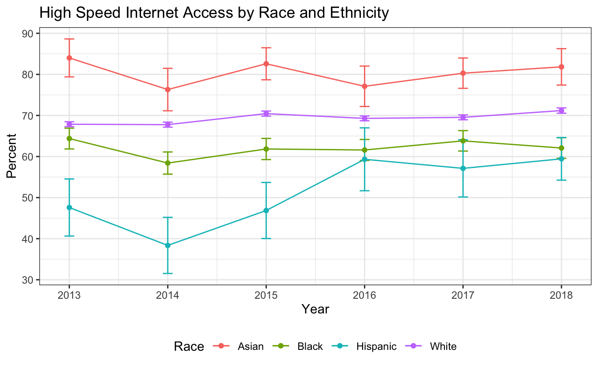

Getting the Data
================

The easiest way to get census microdata is through the Integrated Public Use Microdata Series (IPUMS) hosted by the University of Minnesota. While you can get the data directly from the Census Bureau, IPUMS has made it much easier to compare across multiple years and to select the variables you want. IPUMS also provides a codebook that is easy to refer to and notes any important changes from year to year.

I've put the data for just Kentucky up on GitHub, so I'll read it in from there.

<pre class='chroma'><code class='language-r' data-lang='r'><a href='https://rdrr.io/r/base/library.html'>library</a>(<a href='http://tidyverse.tidyverse.org'>tidyverse</a>) 
<a href='https://rdrr.io/r/base/library.html'>library</a>(<a href='https://renkun.me/formattable'>formattable</a>)
<a href='https://rdrr.io/r/base/library.html'>library</a>(<a href='http://r-survey.r-forge.r-project.org/survey/'>survey</a>)

df &lt;- read_csv("https://raw.github.com/natekratzer/raw_data/master/ky_high_speed_internet.csv")
</code></pre>

Cleaning the Data
=================

When downloading the data it's all numeric, even for variables that are categorial - they've been coded and our first step in the analysis will be using the code book to translate them. I won't show all the codebooks, but for this first variable let's take a look at what IPUMS has to say. For all years NA is coded as 00 and No high speed internet is coded as 20. Prior to 2016 there are detailed codes for the type of internet access, while for 2016 and after the code is collapsed.

I'll use a `case_when()` statement to recode high speed interent access into a categorical variable.

<pre class='chroma'><code class='language-r' data-lang='r'># High Speed Internet
df &lt;- df %&gt;%
  mutate(
    hspd_int = case_when(
      CIHISPEED == 00 ~ NA_character_,
      CIHISPEED == 20 ~ "No",
      CIHISPEED &gt;= 10 &amp; CIHISPEED &lt; 20 ~ "Yes",
      TRUE ~ NA_character_
    )
  )
</code></pre>

Getting wrong answers by not knowing the data
---------------------------------------------

Now that we have a high speed internet category we can group the data and count up how many responses are in each group. I'll also pivot the dataframe to make it easy to calculate percent with high speed internet.

<pre class='chroma'><code class='language-r' data-lang='r'># Count numbers with and without high speed internet
df_group &lt;- df %&gt;%
  group_by(hspd_int, YEAR) %&gt;%
  summarize(count = n(), .groups = "drop")

# Pivot for easier percent calculations
df_wide &lt;- df_group  %&gt;%
  pivot_wider(id_cols = YEAR, names_from = hspd_int, values_from = count) %&gt;%
  mutate(percent_hspd = (Yes / (Yes + No)),
         percent_NA = (`NA` / (Yes + No + `NA`))) 

# Getting the data display ready using transmute, which combines mutate and select
# Formattable is a bit nicer than kable and has some options for nice tables that we'll look at later
# I really like the gt package for tables, but right now it doesn't work with hugodown or blogdown. 
df_wide %&gt;%
  transmute(
    Year = YEAR,
    `Percent Yes` = <a href='https://rdrr.io/pkg/formattable/man/percent.html'>percent</a>(percent_hspd, digits = 1),
    `Percent NA` = <a href='https://rdrr.io/pkg/formattable/man/percent.html'>percent</a>(percent_NA, digits = 1),
    Yes = <a href='https://rdrr.io/pkg/formattable/man/comma.html'>comma</a>(Yes, digits = 0),
    No = <a href='https://rdrr.io/pkg/formattable/man/comma.html'>comma</a>(No, digits = 0),
    `NA` = <a href='https://rdrr.io/pkg/formattable/man/comma.html'>comma</a>(`NA`, digits = 0)
  ) %&gt;%
  <a href='https://rdrr.io/pkg/formattable/man/formattable.html'>formattable</a>()

</code></pre>
<table class="table table-condensed">
<thead>
<tr>
<th style="text-align:right;">
Year
</th>
<th style="text-align:right;">
Percent Yes
</th>
<th style="text-align:right;">
Percent NA
</th>
<th style="text-align:right;">
Yes
</th>
<th style="text-align:right;">
No
</th>
<th style="text-align:right;">
NA
</th>
</tr>
</thead>
<tbody>
<tr>
<td style="text-align:right;">
2013
</td>
<td style="text-align:right;">
86.9%
</td>
<td style="text-align:right;">
27.5%
</td>
<td style="text-align:right;">
28,337
</td>
<td style="text-align:right;">
4,273
</td>
<td style="text-align:right;">
12,387
</td>
</tr>
<tr>
<td style="text-align:right;">
2014
</td>
<td style="text-align:right;">
85.7%
</td>
<td style="text-align:right;">
26.9%
</td>
<td style="text-align:right;">
28,080
</td>
<td style="text-align:right;">
4,699
</td>
<td style="text-align:right;">
12,089
</td>
</tr>
<tr>
<td style="text-align:right;">
2015
</td>
<td style="text-align:right;">
86.4%
</td>
<td style="text-align:right;">
25.7%
</td>
<td style="text-align:right;">
28,743
</td>
<td style="text-align:right;">
4,518
</td>
<td style="text-align:right;">
11,488
</td>
</tr>
<tr>
<td style="text-align:right;">
2016
</td>
<td style="text-align:right;">
81.8%
</td>
<td style="text-align:right;">
20.2%
</td>
<td style="text-align:right;">
29,233
</td>
<td style="text-align:right;">
6,491
</td>
<td style="text-align:right;">
9,015
</td>
</tr>
<tr>
<td style="text-align:right;">
2017
</td>
<td style="text-align:right;">
80.6%
</td>
<td style="text-align:right;">
19.4%
</td>
<td style="text-align:right;">
29,356
</td>
<td style="text-align:right;">
7,084
</td>
<td style="text-align:right;">
8,769
</td>
</tr>
<tr>
<td style="text-align:right;">
2018
</td>
<td style="text-align:right;">
80.5%
</td>
<td style="text-align:right;">
17.3%
</td>
<td style="text-align:right;">
30,264
</td>
<td style="text-align:right;">
7,347
</td>
<td style="text-align:right;">
7,864
</td>
</tr>
</tbody>
</table>

While it looks like we have our answers there are two things that are wrong. First, the Census data is weighted. Instead of a count of responses we want to weight them using the person weights the census provides. We can fix that with a pretty simple change - use [`sum(PERWT)`](https://rdrr.io/r/base/sum.html) instead of `n()` in getting the count of people with and without high speed internet.

<pre class='chroma'><code class='language-r' data-lang='r'># Count numbers with and without high speed internet
df_group &lt;- df %&gt;%
  group_by(hspd_int, YEAR) %&gt;%
  summarize(count = <a href='https://rdrr.io/r/base/sum.html'>sum</a>(PERWT))

#&gt; `summarise()` regrouping output by 'hspd_int' (override with `.groups` argument)

# Pivot for easier percent calculations
df_wide &lt;- df_group  %&gt;%
  pivot_wider(id_cols = YEAR, names_from = hspd_int, values_from = count) %&gt;%
  mutate(percent_hspd = (Yes / (Yes + No)),
         percent_NA = (`NA` / (Yes + No + `NA`)))

# Otput to formattable
df_wide %&gt;%
  transmute(
    Year = YEAR,
    `Percent Yes` = <a href='https://rdrr.io/pkg/formattable/man/percent.html'>percent</a>(percent_hspd, digits = 1),
    `Percent NA` = <a href='https://rdrr.io/pkg/formattable/man/percent.html'>percent</a>(percent_NA, digits = 1),
    Yes = <a href='https://rdrr.io/pkg/formattable/man/comma.html'>comma</a>(Yes, digits = 0),
    No = <a href='https://rdrr.io/pkg/formattable/man/comma.html'>comma</a>(No, digits = 0),
    `NA` = <a href='https://rdrr.io/pkg/formattable/man/comma.html'>comma</a>(`NA`, digits = 0)
  ) %&gt;%
  <a href='https://rdrr.io/pkg/formattable/man/formattable.html'>formattable</a>()

</code></pre>
<table class="table table-condensed">
<thead>
<tr>
<th style="text-align:right;">
Year
</th>
<th style="text-align:right;">
Percent Yes
</th>
<th style="text-align:right;">
Percent NA
</th>
<th style="text-align:right;">
Yes
</th>
<th style="text-align:right;">
No
</th>
<th style="text-align:right;">
NA
</th>
</tr>
</thead>
<tbody>
<tr>
<td style="text-align:right;">
2013
</td>
<td style="text-align:right;">
85.9%
</td>
<td style="text-align:right;">
26.8%
</td>
<td style="text-align:right;">
2,763,511
</td>
<td style="text-align:right;">
454,185
</td>
<td style="text-align:right;">
1,177,599
</td>
</tr>
<tr>
<td style="text-align:right;">
2014
</td>
<td style="text-align:right;">
84.3%
</td>
<td style="text-align:right;">
26.4%
</td>
<td style="text-align:right;">
2,739,012
</td>
<td style="text-align:right;">
509,102
</td>
<td style="text-align:right;">
1,165,343
</td>
</tr>
<tr>
<td style="text-align:right;">
2015
</td>
<td style="text-align:right;">
85.6%
</td>
<td style="text-align:right;">
24.8%
</td>
<td style="text-align:right;">
2,847,329
</td>
<td style="text-align:right;">
478,782
</td>
<td style="text-align:right;">
1,098,981
</td>
</tr>
<tr>
<td style="text-align:right;">
2016
</td>
<td style="text-align:right;">
80.2%
</td>
<td style="text-align:right;">
19.3%
</td>
<td style="text-align:right;">
2,873,926
</td>
<td style="text-align:right;">
707,754
</td>
<td style="text-align:right;">
855,294
</td>
</tr>
<tr>
<td style="text-align:right;">
2017
</td>
<td style="text-align:right;">
79.8%
</td>
<td style="text-align:right;">
18.3%
</td>
<td style="text-align:right;">
2,902,850
</td>
<td style="text-align:right;">
734,608
</td>
<td style="text-align:right;">
816,731
</td>
</tr>
<tr>
<td style="text-align:right;">
2018
</td>
<td style="text-align:right;">
79.0%
</td>
<td style="text-align:right;">
15.9%
</td>
<td style="text-align:right;">
2,969,937
</td>
<td style="text-align:right;">
789,528
</td>
<td style="text-align:right;">
708,937
</td>
</tr>
</tbody>
</table>

This is better. The second problem is harder to spot. There are 3 hints in the data:

1.  There is a very high percentage of NA responses. There are more NA answers than there are people who say they don't have high speed access.
2.  Percent of of people with high speed access is going down over time, while the number of NA answers is going up.
3.  These numbers look very high for Kentucky.

A sensible guess is that people who say they don't have internet access at all aren't then asked about high speed internet and show up as an NA value when we want to code them as not having high speed interent.

So let's get to know the data a bit better by adding in internet access. We'll do the same analysis, but I'll add internet as another id variable just like year. We can see right away that the answers we have above are only including cases where individuals have internet.

<pre class='chroma'><code class='language-r' data-lang='r'>df &lt;- df %&gt;%
  mutate(
    int = case_when(
      CINETHH == 0 ~ NA_character_,
      CINETHH == 1 | CINETHH == 2 ~ "Yes",
      CINETHH == 3 ~ "No",
      TRUE ~ NA_character_
    )
  )

df_group &lt;- df %&gt;%
  group_by(hspd_int, int, YEAR) %&gt;%
  summarize(count = <a href='https://rdrr.io/r/base/sum.html'>sum</a>(PERWT), .groups = "drop")

# Pivot for easier percent calculations
df_wide &lt;- df_group  %&gt;%
  pivot_wider(id_cols = <a href='https://rdrr.io/r/base/c.html'>c</a>(YEAR, int), names_from = hspd_int, values_from = count) %&gt;%
  mutate(percent_hspd = (Yes / (Yes + No)),
         percent_na = (`NA` / (Yes + No + `NA`)))

df_wide %&gt;%
  transmute(
    Internet = int,
    Year = YEAR,
    `Percent Yes` = <a href='https://rdrr.io/pkg/formattable/man/percent.html'>percent</a>(percent_hspd, digits = 1),
    `Percent NA` = <a href='https://rdrr.io/pkg/formattable/man/percent.html'>percent</a>(percent_na, digits = 1),
    Yes = <a href='https://rdrr.io/pkg/formattable/man/comma.html'>comma</a>(Yes, digits = 0),
    No = <a href='https://rdrr.io/pkg/formattable/man/comma.html'>comma</a>(No, digits = 0),
    `NA` = <a href='https://rdrr.io/pkg/formattable/man/comma.html'>comma</a>(`NA`, digits = 0)
  ) %&gt;%
  <a href='https://rdrr.io/pkg/formattable/man/formattable.html'>formattable</a>()

</code></pre>
<table class="table table-condensed">
<thead>
<tr>
<th style="text-align:right;">
Internet
</th>
<th style="text-align:right;">
Year
</th>
<th style="text-align:right;">
Percent Yes
</th>
<th style="text-align:right;">
Percent NA
</th>
<th style="text-align:right;">
Yes
</th>
<th style="text-align:right;">
No
</th>
<th style="text-align:right;">
NA
</th>
</tr>
</thead>
<tbody>
<tr>
<td style="text-align:right;">
Yes
</td>
<td style="text-align:right;">
2013
</td>
<td style="text-align:right;">
85.9%
</td>
<td style="text-align:right;">
5.4%
</td>
<td style="text-align:right;">
2,763,511
</td>
<td style="text-align:right;">
454,185
</td>
<td style="text-align:right;">
185,297
</td>
</tr>
<tr>
<td style="text-align:right;">
Yes
</td>
<td style="text-align:right;">
2014
</td>
<td style="text-align:right;">
84.3%
</td>
<td style="text-align:right;">
5.6%
</td>
<td style="text-align:right;">
2,739,012
</td>
<td style="text-align:right;">
509,102
</td>
<td style="text-align:right;">
193,284
</td>
</tr>
<tr>
<td style="text-align:right;">
Yes
</td>
<td style="text-align:right;">
2015
</td>
<td style="text-align:right;">
85.6%
</td>
<td style="text-align:right;">
6.1%
</td>
<td style="text-align:right;">
2,847,329
</td>
<td style="text-align:right;">
478,782
</td>
<td style="text-align:right;">
216,933
</td>
</tr>
<tr>
<td style="text-align:right;">
Yes
</td>
<td style="text-align:right;">
2016
</td>
<td style="text-align:right;">
80.2%
</td>
<td style="text-align:right;">
3.5%
</td>
<td style="text-align:right;">
2,873,926
</td>
<td style="text-align:right;">
707,754
</td>
<td style="text-align:right;">
128,501
</td>
</tr>
<tr>
<td style="text-align:right;">
Yes
</td>
<td style="text-align:right;">
2017
</td>
<td style="text-align:right;">
79.8%
</td>
<td style="text-align:right;">
3.3%
</td>
<td style="text-align:right;">
2,902,850
</td>
<td style="text-align:right;">
734,608
</td>
<td style="text-align:right;">
124,375
</td>
</tr>
<tr>
<td style="text-align:right;">
Yes
</td>
<td style="text-align:right;">
2018
</td>
<td style="text-align:right;">
79.0%
</td>
<td style="text-align:right;">
3.2%
</td>
<td style="text-align:right;">
2,969,937
</td>
<td style="text-align:right;">
789,528
</td>
<td style="text-align:right;">
125,088
</td>
</tr>
<tr>
<td style="text-align:right;">
No
</td>
<td style="text-align:right;">
2013
</td>
<td style="text-align:right;">
NA
</td>
<td style="text-align:right;">
NA
</td>
<td style="text-align:right;">
NA
</td>
<td style="text-align:right;">
NA
</td>
<td style="text-align:right;">
866,163
</td>
</tr>
<tr>
<td style="text-align:right;">
No
</td>
<td style="text-align:right;">
2014
</td>
<td style="text-align:right;">
NA
</td>
<td style="text-align:right;">
NA
</td>
<td style="text-align:right;">
NA
</td>
<td style="text-align:right;">
NA
</td>
<td style="text-align:right;">
841,712
</td>
</tr>
<tr>
<td style="text-align:right;">
No
</td>
<td style="text-align:right;">
2015
</td>
<td style="text-align:right;">
NA
</td>
<td style="text-align:right;">
NA
</td>
<td style="text-align:right;">
NA
</td>
<td style="text-align:right;">
NA
</td>
<td style="text-align:right;">
753,210
</td>
</tr>
<tr>
<td style="text-align:right;">
No
</td>
<td style="text-align:right;">
2016
</td>
<td style="text-align:right;">
NA
</td>
<td style="text-align:right;">
NA
</td>
<td style="text-align:right;">
NA
</td>
<td style="text-align:right;">
NA
</td>
<td style="text-align:right;">
595,545
</td>
</tr>
<tr>
<td style="text-align:right;">
No
</td>
<td style="text-align:right;">
2017
</td>
<td style="text-align:right;">
NA
</td>
<td style="text-align:right;">
NA
</td>
<td style="text-align:right;">
NA
</td>
<td style="text-align:right;">
NA
</td>
<td style="text-align:right;">
560,373
</td>
</tr>
<tr>
<td style="text-align:right;">
No
</td>
<td style="text-align:right;">
2018
</td>
<td style="text-align:right;">
NA
</td>
<td style="text-align:right;">
NA
</td>
<td style="text-align:right;">
NA
</td>
<td style="text-align:right;">
NA
</td>
<td style="text-align:right;">
452,152
</td>
</tr>
<tr>
<td style="text-align:right;">
NA
</td>
<td style="text-align:right;">
2013
</td>
<td style="text-align:right;">
NA
</td>
<td style="text-align:right;">
NA
</td>
<td style="text-align:right;">
NA
</td>
<td style="text-align:right;">
NA
</td>
<td style="text-align:right;">
126,139
</td>
</tr>
<tr>
<td style="text-align:right;">
NA
</td>
<td style="text-align:right;">
2014
</td>
<td style="text-align:right;">
NA
</td>
<td style="text-align:right;">
NA
</td>
<td style="text-align:right;">
NA
</td>
<td style="text-align:right;">
NA
</td>
<td style="text-align:right;">
130,347
</td>
</tr>
<tr>
<td style="text-align:right;">
NA
</td>
<td style="text-align:right;">
2015
</td>
<td style="text-align:right;">
NA
</td>
<td style="text-align:right;">
NA
</td>
<td style="text-align:right;">
NA
</td>
<td style="text-align:right;">
NA
</td>
<td style="text-align:right;">
128,838
</td>
</tr>
<tr>
<td style="text-align:right;">
NA
</td>
<td style="text-align:right;">
2016
</td>
<td style="text-align:right;">
NA
</td>
<td style="text-align:right;">
NA
</td>
<td style="text-align:right;">
NA
</td>
<td style="text-align:right;">
NA
</td>
<td style="text-align:right;">
131,248
</td>
</tr>
<tr>
<td style="text-align:right;">
NA
</td>
<td style="text-align:right;">
2017
</td>
<td style="text-align:right;">
NA
</td>
<td style="text-align:right;">
NA
</td>
<td style="text-align:right;">
NA
</td>
<td style="text-align:right;">
NA
</td>
<td style="text-align:right;">
131,983
</td>
</tr>
<tr>
<td style="text-align:right;">
NA
</td>
<td style="text-align:right;">
2018
</td>
<td style="text-align:right;">
NA
</td>
<td style="text-align:right;">
NA
</td>
<td style="text-align:right;">
NA
</td>
<td style="text-align:right;">
NA
</td>
<td style="text-align:right;">
131,697
</td>
</tr>
</tbody>
</table>

So what we were looking at was the percentage of people with internet who have high speed internet. What we want is the percentage of all people who have high speed internet. We can fix the way we create our categories by saying that anyone who has no internet also has no high speed internet.

<pre class='chroma'><code class='language-r' data-lang='r'>df &lt;- df %&gt;%
  mutate(
    int = case_when(
      CINETHH == 0 ~ NA_character_,
      CINETHH == 1 | CINETHH == 2 ~ "Yes",
      CINETHH == 3 ~ "No",
      TRUE ~ NA_character_
    ),
    hspd_int = case_when(
      CIHISPEED == 00 &amp; int != "No" ~ NA_character_,
      CIHISPEED == 20 | int == "No" ~ "No",
      CIHISPEED &gt;= 10 &amp; CIHISPEED &lt; 20 ~ "Yes",
      TRUE ~ NA_character_
    )
  )

# Count numbers with and without high speed internet
df_group &lt;- df %&gt;%
  group_by(hspd_int, YEAR) %&gt;%
  summarize(count = <a href='https://rdrr.io/r/base/sum.html'>sum</a>(PERWT), .groups = "drop")

# Pivot for easier percent calculations
df_wide &lt;- df_group  %&gt;%
  pivot_wider(id_cols = <a href='https://rdrr.io/r/base/c.html'>c</a>(YEAR), names_from = hspd_int, values_from = count) %&gt;%
  mutate(percent_hspd = (Yes / (Yes + No)),
         percent_na = (`NA` / (Yes + No + `NA`)))

df_wide %&gt;%
  transmute(
    Year = YEAR,
    `Percent Yes` = <a href='https://rdrr.io/pkg/formattable/man/percent.html'>percent</a>(percent_hspd, digits = 1),
    `Percent NA` = <a href='https://rdrr.io/pkg/formattable/man/percent.html'>percent</a>(percent_na, digits = 1),
    Yes = <a href='https://rdrr.io/pkg/formattable/man/comma.html'>comma</a>(Yes, digits = 0),
    No = <a href='https://rdrr.io/pkg/formattable/man/comma.html'>comma</a>(No, digits = 0),
    `NA` = <a href='https://rdrr.io/pkg/formattable/man/comma.html'>comma</a>(`NA`, digits = 0)
  ) %&gt;%
  <a href='https://rdrr.io/pkg/formattable/man/formattable.html'>formattable</a>()

</code></pre>
<table class="table table-condensed">
<thead>
<tr>
<th style="text-align:right;">
Year
</th>
<th style="text-align:right;">
Percent Yes
</th>
<th style="text-align:right;">
Percent NA
</th>
<th style="text-align:right;">
Yes
</th>
<th style="text-align:right;">
No
</th>
<th style="text-align:right;">
NA
</th>
</tr>
</thead>
<tbody>
<tr>
<td style="text-align:right;">
2013
</td>
<td style="text-align:right;">
67.7%
</td>
<td style="text-align:right;">
7.1%
</td>
<td style="text-align:right;">
2,763,511
</td>
<td style="text-align:right;">
1,320,348
</td>
<td style="text-align:right;">
311,436
</td>
</tr>
<tr>
<td style="text-align:right;">
2014
</td>
<td style="text-align:right;">
67.0%
</td>
<td style="text-align:right;">
7.3%
</td>
<td style="text-align:right;">
2,739,012
</td>
<td style="text-align:right;">
1,350,814
</td>
<td style="text-align:right;">
323,631
</td>
</tr>
<tr>
<td style="text-align:right;">
2015
</td>
<td style="text-align:right;">
69.8%
</td>
<td style="text-align:right;">
7.8%
</td>
<td style="text-align:right;">
2,847,329
</td>
<td style="text-align:right;">
1,231,992
</td>
<td style="text-align:right;">
345,771
</td>
</tr>
<tr>
<td style="text-align:right;">
2016
</td>
<td style="text-align:right;">
68.8%
</td>
<td style="text-align:right;">
5.9%
</td>
<td style="text-align:right;">
2,873,926
</td>
<td style="text-align:right;">
1,303,299
</td>
<td style="text-align:right;">
259,749
</td>
</tr>
<tr>
<td style="text-align:right;">
2017
</td>
<td style="text-align:right;">
69.2%
</td>
<td style="text-align:right;">
5.8%
</td>
<td style="text-align:right;">
2,902,850
</td>
<td style="text-align:right;">
1,294,981
</td>
<td style="text-align:right;">
256,358
</td>
</tr>
<tr>
<td style="text-align:right;">
2018
</td>
<td style="text-align:right;">
70.5%
</td>
<td style="text-align:right;">
5.7%
</td>
<td style="text-align:right;">
2,969,937
</td>
<td style="text-align:right;">
1,241,680
</td>
<td style="text-align:right;">
256,785
</td>
</tr>
</tbody>
</table>

These results look much better, although still quite a few NA results.

Group Quarters in the Census
----------------------------

The census data includes individuals living in group quarters (mostly prisons, senior living centers, and dorms, but includes any sort of communal living arrangement). However, all census questions about appliances and utilities (the category that internet access falls under) are NA for group quarters. So we'll add one more line to filter out individuals living in group quarters (a common practice when working with microdata). The code below adds a filter for Group Quarters. Since this table is showing correct results I'll also add a little additional formatting to make it stand out from the others.

I'll also note that the way the Census Bureau constructs weights is very convenient for getting totals. While I'm focusing on the percent of people who have internet access, the Yes and No columns are accurate estimates of the population with and without access.

<pre class='chroma'><code class='language-r' data-lang='r'># Count numbers with and without high speed internet
df_group &lt;- df %&gt;%
  <a href='https://rdrr.io/r/stats/filter.html'>filter</a>(GQ == 1 | GQ ==2 | GQ == 5) %&gt;%
  group_by(hspd_int, YEAR) %&gt;%
  summarize(count = <a href='https://rdrr.io/r/base/sum.html'>sum</a>(PERWT), .groups = "drop")

# Pivot for easier percent calculations
df_wide &lt;- df_group  %&gt;%
  pivot_wider(id_cols = <a href='https://rdrr.io/r/base/c.html'>c</a>(YEAR), names_from = hspd_int, values_from = count) %&gt;%
  mutate(percent_hspd = (Yes / (Yes + No)),
         percent_na = (`NA` / (Yes + No + `NA`)))

hspd_table &lt;- df_wide %&gt;%
  transmute(
    Year = YEAR,
    `Percent Yes` = <a href='https://rdrr.io/pkg/formattable/man/percent.html'>percent</a>(percent_hspd, digits = 1),
    `Percent NA` = <a href='https://rdrr.io/pkg/formattable/man/percent.html'>percent</a>(percent_na, digits = 1),
    Yes = <a href='https://rdrr.io/pkg/formattable/man/comma.html'>comma</a>(Yes, digits = 0),
    No = <a href='https://rdrr.io/pkg/formattable/man/comma.html'>comma</a>(No, digits = 0),
    `NA` = <a href='https://rdrr.io/pkg/formattable/man/comma.html'>comma</a>(`NA`, digits = 0)
  ) %&gt;%
  <a href='https://rdrr.io/pkg/formattable/man/formattable.html'>formattable</a>(align = <a href='https://rdrr.io/r/base/c.html'>c</a>(<a href='https://rdrr.io/r/base/rep.html'>rep</a>("l", 6)),
              <a href='https://rdrr.io/r/base/list.html'>list</a>(
                `Percent Yes` = <a href='https://rdrr.io/pkg/formattable/man/color_bar.html'>color_bar</a>("lightblue"),
                `Percent NA` = <a href='https://rdrr.io/pkg/formattable/man/color_bar.html'>color_bar</a>("lightgrey")
              ))
</code></pre>

That removed about half of our NA values. It might be nice to know a bit more about the missing data, but at around 3 percent of observations it's unlikely to change our substantive conclusions. I suspect these are cases where there wasn't an answer for that question. We'll keep an eye on NA values as we do the analysis, because as we get into questions like how internet access varies by race, income, age, and education we'll want to know if NA answers are more or less likely in any of those categories.

Checking against data.census.gov
--------------------------------

To do a quick check against the way the census bureau itself analyzes the data I looked at data.census.gov for 2018 in Kentucky. An important note is that their data is for households, and so their numeric counts look quite different because I'm counting number of people. They also have a breakdown where cellular is included in broadband, which I do not want, as a cell phone is not really an adequate work or study device. So to get to what I have we need to add "Broadband such as cable, fiber optic or DSL" and "Satellite Internet service", which gets us to 70.8% compared to the 70.5% in this analysis. The difference is small and most likely the result of their analysis being weighted to the household level rather than the person level. (Internet is measured at the household level and the same for every person in the household, but by choosing to weight it at the person level I am a) letting us talk in terms of people, b) giving more weight to larger households, c) making it possible to breakdown internet access by categories that do vary by household, like age).

Analysis
========

Going forward we're going to want to filter by group quarters, so let's apply that filter to our main dataframe.

<pre class='chroma'><code class='language-r' data-lang='r'>df &lt;- df %&gt;%
    <a href='https://rdrr.io/r/stats/filter.html'>filter</a>(GQ == 1 | GQ ==2 | GQ == 5) 
</code></pre>

Standard Errors
---------------

Know that we know the data we'd also like to know how uncertain our sample is so that we know if movements over time are real or just a result of noisy data. There are a few ways to do this. The `survey` package does an excellent job with complex survey designs, but does require learning a new syntax to use. The alternative I'll use here is a method known as bootstrap. IPUMS suggests using bootstrap might be the best way to get standard errors on census microdata. The basic idea of the bootstrap is to resample the existing data and use the sampling error from that as an estimate for sampling error in the overall population. Let's do an example with high speed internet in 2018 to see how it works. The output here will be the mean and standard deviation for Kentucky. (We'll use the standard error to calculate confidence intervals once we start displaying actual results.)

<pre class='chroma'><code class='language-r' data-lang='r'>#set seed
<a href='https://rdrr.io/r/base/Random.html'>set.seed</a>(42)

# Filter to just 2018
# Exclude NA values
# Recode as numeric vector of 1 and 0
# The numeric 1 and 0 form will make it much easier to get means without pivoting, which matters a lot when doing this 1000 times
df2018 &lt;- df %&gt;%
  <a href='https://rdrr.io/r/stats/filter.html'>filter</a>(YEAR == 2018 &amp; !<a href='https://rdrr.io/r/base/NA.html'>is.na</a>(hspd_int)) %&gt;%
  mutate(hspd_num = if_else(hspd_int == "Yes", 1, 0)) %&gt;%
  select(hspd_num, PERWT)

# Write a function so I can map over it.
# In this case, we need the function to do the same thing X number of times and assign an ID that we can use as a grouping variable
create_samples &lt;- function(sample_id){
  df_out &lt;- df2018[<a href='https://rdrr.io/r/base/sample.html'>sample</a>(<a href='https://rdrr.io/r/base/nrow.html'>nrow</a>(df2018), <a href='https://rdrr.io/r/base/nrow.html'>nrow</a>(df2018), replace = TRUE) , ] %&gt;%
    as_tibble()
  df_out$sample_id &lt;- sample_id
  <a href='https://rdrr.io/r/base/function.html'>return</a>(df_out)
}

nlist &lt;- <a href='https://rdrr.io/r/base/list.html'>as.list</a>(<a href='https://rdrr.io/r/base/seq.html'>seq</a>(1, 5000, by = 1))
samples &lt;- purrr::<a href='https://purrr.tidyverse.org/reference/map.html'>map_df</a>(nlist, create_samples)

sample_summary &lt;- samples %&gt;%
  group_by(sample_id) %&gt;%
  mutate(ind_weight = PERWT / <a href='https://rdrr.io/r/base/sum.html'>sum</a>(PERWT),
         hspd_weight = hspd_num * ind_weight) %&gt;% # PERWT is population and doesn't sum to 1. Rescale it to sum to one
  summarize(group_mean = <a href='https://rdrr.io/r/base/sum.html'>sum</a>(hspd_weight),
            weight_check = <a href='https://rdrr.io/r/base/sum.html'>sum</a>(ind_weight), .groups = "drop") # Check that my weights add up to one

display_tbl &lt;- tibble(
  mean = <a href='https://rdrr.io/r/base/mean.html'>mean</a>(sample_summary$group_mean),
  sd = <a href='https://rdrr.io/r/stats/sd.html'>sd</a>(sample_summary$group_mean)
) 

display_tbl %&gt;% 
  <a href='https://rdrr.io/pkg/formattable/man/formattable.html'>formattable</a>()

</code></pre>
<table class="table table-condensed">
<thead>
<tr>
<th style="text-align:right;">
mean
</th>
<th style="text-align:right;">
sd
</th>
</tr>
</thead>
<tbody>
<tr>
<td style="text-align:right;">
0.705127
</td>
<td style="text-align:right;">
0.002894493
</td>
</tr>
</tbody>
</table>

We can also take a look at our bootstrap graphically. We want to check that the distribution of the sample is roughly normal. If it's not, that means we didn't do enough bootstrap samples for the Central Limit Theorem to kick in.

<pre class='chroma'><code class='language-r' data-lang='r'>#Check that the distribution is normal and than the middle of the distribution is close to the 70.5% we estimated had internet access above
plt &lt;- ggplot(sample_summary, aes(group_mean)) +
  geom_density() + theme_bw() +
  labs(title = "Bootstrapped means of High Speed Internet Access",
       x = "Mean", 
       y = "Kernel Density")

plt

</code></pre>

Checking our results against the survey package
-----------------------------------------------

Above we found a mean of 0.705 for 2018 and and standard error of 0.0029 based on our bootstrap analysis. It's worth checking that this is the same result we'd get using an analytic approach (instead of bootstrap). So here's the code to take our same `df2018` dataframe and use the survey package.

<pre class='chroma'><code class='language-r' data-lang='r'><a href='https://rdrr.io/r/base/library.html'>library</a>(<a href='http://r-survey.r-forge.r-project.org/survey/'>survey</a>)

# Here we're assuming a simple design. 
# Survey requires the creation of a design object and then has functions that work with that object.
# You can get more complicated, which is when the survey package would be most useful.
svy_df &lt;- <a href='https://rdrr.io/pkg/survey/man/svydesign.html'>svydesign</a>(ids = ~ 1, weights = ~PERWT, data = df2018)

# Taking the mean and standard error from our design object
hint_tbl &lt;- <a href='https://rdrr.io/pkg/survey/man/surveysummary.html'>svymean</a>(~hspd_num, design = svy_df)

hint_tbl &lt;- as_tibble(hint_tbl)
<a href='https://rdrr.io/r/base/names.html'>names</a>(hint_tbl) &lt;- <a href='https://rdrr.io/r/base/c.html'>c</a>("mean", "sd") #The names weren't coerced correctly when transforming into a tibble. 

<a href='https://rdrr.io/pkg/formattable/man/formattable.html'>formattable</a>(hint_tbl)

</code></pre>
<table class="table table-condensed">
<thead>
<tr>
<th style="text-align:right;">
mean
</th>
<th style="text-align:right;">
sd
</th>
</tr>
</thead>
<tbody>
<tr>
<td style="text-align:right;">
0.7051774
</td>
<td style="text-align:right;">
0.00293509
</td>
</tr>
</tbody>
</table>

These results are very similar. Following the IPUMS recommendation we'll continue on with the bootstrap, but it's good to know the results are the same for practical purposes. So now instead of just doing 2018, we'll need to do every year. We've already one the mean values for every year, and they're still saved in the `df_wide` variable right now. So let's write a function for bootstrap that will let us find standard errors for every year or for any other grouping we choose.

Writing a bootstrap function
----------------------------

<pre class='chroma'><code class='language-r' data-lang='r'># Create a helper function
# It needs to have a way to recieve the dataframe from the function that calls it, so we've added a second argument
create_samples &lt;- function(sample_id, df){
  
  df_out &lt;- df[<a href='https://rdrr.io/r/base/sample.html'>sample</a>(<a href='https://rdrr.io/r/base/nrow.html'>nrow</a>(df), <a href='https://rdrr.io/r/base/nrow.html'>nrow</a>(df), replace = TRUE) , ] %&gt;%
    as_tibble()
  
  df_out$sample_id &lt;- sample_id
  
  <a href='https://rdrr.io/r/base/function.html'>return</a>(df_out)
}

#Need to be able to take in grouping variables so that the summaries can be specific to the groups
bootstrap_pums &lt;- function(df, num_samples, group_vars) {
  
  nlist &lt;- <a href='https://rdrr.io/r/base/list.html'>as.list</a>(<a href='https://rdrr.io/r/base/seq.html'>seq</a>(1, num_samples, by = 1))
  samples &lt;- purrr::<a href='https://purrr.tidyverse.org/reference/map.html'>map_df</a>(nlist, create_samples, df)
  
  sample_summary &lt;- samples %&gt;%
    group_by( sample_id, across( {{group_vars}} )) %&gt;%
    mutate(ind_weight = PERWT / <a href='https://rdrr.io/r/base/sum.html'>sum</a>(PERWT),
           hspd_weight = hspd_n * ind_weight) %&gt;% # PERWT sums to population instead of to 1. Rescale it to sum to 1.
    summarize(group_mean = <a href='https://rdrr.io/r/base/sum.html'>sum</a>(hspd_weight), .groups = "drop") # Not dropping .groups here results in problems in the next group_by call.
  
  sample_sd &lt;- sample_summary %&gt;%
    group_by( across( {{ group_vars }} )) %&gt;%
    summarize(sd = <a href='https://rdrr.io/r/stats/sd.html'>sd</a>(group_mean), .groups = "drop")
}

# We do need to prep the data a little so that we're not carrying through the whole dataframe.
df_in &lt;- df %&gt;%
   <a href='https://rdrr.io/r/stats/filter.html'>filter</a>(!<a href='https://rdrr.io/r/base/NA.html'>is.na</a>(hspd_int)) %&gt;%
   mutate(hspd_n = if_else(hspd_int == "Yes", 1, 0)) %&gt;%
   select(hspd_n, PERWT, YEAR)

# And finally we can call the function
boot_results &lt;- bootstrap_pums(df = df_in, num_samples = 100, group_vars = YEAR)

boot_results %&gt;%
  <a href='https://rdrr.io/pkg/formattable/man/formattable.html'>formattable</a>()

</code></pre>
<table class="table table-condensed">
<thead>
<tr>
<th style="text-align:right;">
YEAR
</th>
<th style="text-align:right;">
sd
</th>
</tr>
</thead>
<tbody>
<tr>
<td style="text-align:right;">
2013
</td>
<td style="text-align:right;">
0.003242816
</td>
</tr>
<tr>
<td style="text-align:right;">
2014
</td>
<td style="text-align:right;">
0.003115310
</td>
</tr>
<tr>
<td style="text-align:right;">
2015
</td>
<td style="text-align:right;">
0.002885018
</td>
</tr>
<tr>
<td style="text-align:right;">
2016
</td>
<td style="text-align:right;">
0.002913172
</td>
</tr>
<tr>
<td style="text-align:right;">
2017
</td>
<td style="text-align:right;">
0.002840172
</td>
</tr>
<tr>
<td style="text-align:right;">
2018
</td>
<td style="text-align:right;">
0.002787895
</td>
</tr>
</tbody>
</table>

Now that we have our bootstrap standard errors we can combine them with the data and plot them. We'll use 95% confidence intervals, which we get by multiplying the

<pre class='chroma'><code class='language-r' data-lang='r'>df_plt &lt;- df_wide %&gt;%
  full_join(boot_results, by = "YEAR") %&gt;%
  transmute(Year = YEAR,
            Percent = 100 * percent_hspd,
            me = 100 * 1.96 * sd)
  
plt_int &lt;- ggplot(df_plt, aes(x = Year, y = Percent)) +
  geom_errorbar(aes(ymin = Percent - me, ymax = Percent + me), width = .1) +
  geom_line() +
  geom_point() +
  theme_bw() +
  labs(title = "High Speed Internet Access") +
  theme(legend.position = "bottom")

plt_int

</code></pre>

Race, Poverty, Age
------------------

### Race

We'll build a table by race and year. It's a long table, so I've added some color to both the `Percent Yes` column and the `Percent NA` column. For the NA column I'm using red to pick out cases where the NA values were particularly high, because we want to see if there's a pattern there. For the Percent Yes column I'm checking to see where the values are particularly low.

<pre class='chroma'><code class='language-r' data-lang='r'># Let's build a table first and then we'll do the standard errors

# Coding a race variable using case_when
df &lt;- df %&gt;%
  mutate(race = case_when(
            RACE == 1 ~ "White",
            RACE == 2 ~ "Black",
            RACE &gt; 3 &amp; RACE &lt; 7 ~ "Asian",
            HISPAN &gt; 0 &amp; HISPAN &lt; 5 ~ "Hispanic",
            TRUE ~ "All Others"
          ))

df_group &lt;- df %&gt;%
  group_by(hspd_int, race, YEAR) %&gt;%
  summarize(count = <a href='https://rdrr.io/r/base/sum.html'>sum</a>(PERWT), .groups = "drop")

# Pivot for easier percent calculations
df_wide &lt;- df_group  %&gt;%
  pivot_wider(id_cols = <a href='https://rdrr.io/r/base/c.html'>c</a>(race, YEAR), names_from = hspd_int, values_from = count) %&gt;%
  mutate(percent_hspd = (Yes / (Yes + No)),
         percent_na = (`NA` / (Yes + No + `NA`)))

df_wide %&gt;%
  transmute(
    Year = YEAR,
    Race = race,
    `Percent Yes` = <a href='https://rdrr.io/pkg/formattable/man/percent.html'>percent</a>(percent_hspd, digits = 1),
    `Percent NA` = <a href='https://rdrr.io/pkg/formattable/man/percent.html'>percent</a>(percent_na, digits = 1),
    Yes = <a href='https://rdrr.io/pkg/formattable/man/comma.html'>comma</a>(Yes, digits = 0),
    No = <a href='https://rdrr.io/pkg/formattable/man/comma.html'>comma</a>(No, digits = 0),
    `NA` = <a href='https://rdrr.io/pkg/formattable/man/comma.html'>comma</a>(`NA`, digits = 0)
  ) %&gt;%
  <a href='https://rdrr.io/pkg/formattable/man/formattable.html'>formattable</a>(align = <a href='https://rdrr.io/r/base/c.html'>c</a>(<a href='https://rdrr.io/r/base/rep.html'>rep</a>("l", 7)),
              <a href='https://rdrr.io/r/base/list.html'>list</a>(
                `Percent Yes` = <a href='https://rdrr.io/pkg/formattable/man/color_tile.html'>color_tile</a>("#ff7f7f", "lightgreen"),
                `Percent NA` = <a href='https://rdrr.io/pkg/formattable/man/color_tile.html'>color_tile</a>("lightgreen", "#ff7f7f")
              ))

</code></pre>
<table class="table table-condensed">
<thead>
<tr>
<th style="text-align:left;">
Year
</th>
<th style="text-align:left;">
Race
</th>
<th style="text-align:left;">
Percent Yes
</th>
<th style="text-align:left;">
Percent NA
</th>
<th style="text-align:left;">
Yes
</th>
<th style="text-align:left;">
No
</th>
<th style="text-align:left;">
NA
</th>
</tr>
</thead>
<tbody>
<tr>
<td style="text-align:left;">
2013
</td>
<td style="text-align:left;">
All Others
</td>
<td style="text-align:left;">
72.3%
</td>
<td style="text-align:left;">
5.7%
</td>
<td style="text-align:left;">
58,286
</td>
<td style="text-align:left;">
22,297
</td>
<td style="text-align:left;">
4,895
</td>
</tr>
<tr>
<td style="text-align:left;">
2014
</td>
<td style="text-align:left;">
All Others
</td>
<td style="text-align:left;">
70.4%
</td>
<td style="text-align:left;">
4.0%
</td>
<td style="text-align:left;">
65,866
</td>
<td style="text-align:left;">
27,716
</td>
<td style="text-align:left;">
3,909
</td>
</tr>
<tr>
<td style="text-align:left;">
2015
</td>
<td style="text-align:left;">
All Others
</td>
<td style="text-align:left;">
71.1%
</td>
<td style="text-align:left;">
6.9%
</td>
<td style="text-align:left;">
59,620
</td>
<td style="text-align:left;">
24,258
</td>
<td style="text-align:left;">
6,191
</td>
</tr>
<tr>
<td style="text-align:left;">
2016
</td>
<td style="text-align:left;">
All Others
</td>
<td style="text-align:left;">
74.8%
</td>
<td style="text-align:left;">
3.6%
</td>
<td style="text-align:left;">
63,197
</td>
<td style="text-align:left;">
21,335
</td>
<td style="text-align:left;">
3,118
</td>
</tr>
<tr>
<td style="text-align:left;">
2017
</td>
<td style="text-align:left;">
All Others
</td>
<td style="text-align:left;">
70.9%
</td>
<td style="text-align:left;">
2.2%
</td>
<td style="text-align:left;">
68,874
</td>
<td style="text-align:left;">
28,233
</td>
<td style="text-align:left;">
2,227
</td>
</tr>
<tr>
<td style="text-align:left;">
2018
</td>
<td style="text-align:left;">
All Others
</td>
<td style="text-align:left;">
71.6%
</td>
<td style="text-align:left;">
4.9%
</td>
<td style="text-align:left;">
73,910
</td>
<td style="text-align:left;">
29,379
</td>
<td style="text-align:left;">
5,279
</td>
</tr>
<tr>
<td style="text-align:left;">
2013
</td>
<td style="text-align:left;">
Asian
</td>
<td style="text-align:left;">
84.0%
</td>
<td style="text-align:left;">
3.9%
</td>
<td style="text-align:left;">
42,194
</td>
<td style="text-align:left;">
8,034
</td>
<td style="text-align:left;">
2,064
</td>
</tr>
<tr>
<td style="text-align:left;">
2014
</td>
<td style="text-align:left;">
Asian
</td>
<td style="text-align:left;">
76.3%
</td>
<td style="text-align:left;">
2.1%
</td>
<td style="text-align:left;">
41,559
</td>
<td style="text-align:left;">
12,906
</td>
<td style="text-align:left;">
1,189
</td>
</tr>
<tr>
<td style="text-align:left;">
2015
</td>
<td style="text-align:left;">
Asian
</td>
<td style="text-align:left;">
82.6%
</td>
<td style="text-align:left;">
2.9%
</td>
<td style="text-align:left;">
48,766
</td>
<td style="text-align:left;">
10,284
</td>
<td style="text-align:left;">
1,764
</td>
</tr>
<tr>
<td style="text-align:left;">
2016
</td>
<td style="text-align:left;">
Asian
</td>
<td style="text-align:left;">
77.1%
</td>
<td style="text-align:left;">
10.3%
</td>
<td style="text-align:left;">
43,768
</td>
<td style="text-align:left;">
13,001
</td>
<td style="text-align:left;">
6,550
</td>
</tr>
<tr>
<td style="text-align:left;">
2017
</td>
<td style="text-align:left;">
Asian
</td>
<td style="text-align:left;">
80.3%
</td>
<td style="text-align:left;">
1.1%
</td>
<td style="text-align:left;">
52,465
</td>
<td style="text-align:left;">
12,878
</td>
<td style="text-align:left;">
703
</td>
</tr>
<tr>
<td style="text-align:left;">
2018
</td>
<td style="text-align:left;">
Asian
</td>
<td style="text-align:left;">
81.8%
</td>
<td style="text-align:left;">
2.5%
</td>
<td style="text-align:left;">
52,838
</td>
<td style="text-align:left;">
11,733
</td>
<td style="text-align:left;">
1,660
</td>
</tr>
<tr>
<td style="text-align:left;">
2013
</td>
<td style="text-align:left;">
Black
</td>
<td style="text-align:left;">
64.4%
</td>
<td style="text-align:left;">
8.8%
</td>
<td style="text-align:left;">
192,209
</td>
<td style="text-align:left;">
106,359
</td>
<td style="text-align:left;">
28,707
</td>
</tr>
<tr>
<td style="text-align:left;">
2014
</td>
<td style="text-align:left;">
Black
</td>
<td style="text-align:left;">
58.4%
</td>
<td style="text-align:left;">
9.4%
</td>
<td style="text-align:left;">
171,066
</td>
<td style="text-align:left;">
121,804
</td>
<td style="text-align:left;">
30,304
</td>
</tr>
<tr>
<td style="text-align:left;">
2015
</td>
<td style="text-align:left;">
Black
</td>
<td style="text-align:left;">
61.8%
</td>
<td style="text-align:left;">
12.1%
</td>
<td style="text-align:left;">
182,537
</td>
<td style="text-align:left;">
112,665
</td>
<td style="text-align:left;">
40,535
</td>
</tr>
<tr>
<td style="text-align:left;">
2016
</td>
<td style="text-align:left;">
Black
</td>
<td style="text-align:left;">
61.6%
</td>
<td style="text-align:left;">
4.5%
</td>
<td style="text-align:left;">
204,021
</td>
<td style="text-align:left;">
127,215
</td>
<td style="text-align:left;">
15,628
</td>
</tr>
<tr>
<td style="text-align:left;">
2017
</td>
<td style="text-align:left;">
Black
</td>
<td style="text-align:left;">
63.8%
</td>
<td style="text-align:left;">
2.3%
</td>
<td style="text-align:left;">
216,023
</td>
<td style="text-align:left;">
122,491
</td>
<td style="text-align:left;">
8,042
</td>
</tr>
<tr>
<td style="text-align:left;">
2018
</td>
<td style="text-align:left;">
Black
</td>
<td style="text-align:left;">
62.1%
</td>
<td style="text-align:left;">
3.0%
</td>
<td style="text-align:left;">
200,403
</td>
<td style="text-align:left;">
122,453
</td>
<td style="text-align:left;">
9,905
</td>
</tr>
<tr>
<td style="text-align:left;">
2013
</td>
<td style="text-align:left;">
Hispanic
</td>
<td style="text-align:left;">
47.6%
</td>
<td style="text-align:left;">
4.0%
</td>
<td style="text-align:left;">
21,571
</td>
<td style="text-align:left;">
23,758
</td>
<td style="text-align:left;">
1,904
</td>
</tr>
<tr>
<td style="text-align:left;">
2014
</td>
<td style="text-align:left;">
Hispanic
</td>
<td style="text-align:left;">
38.4%
</td>
<td style="text-align:left;">
12.1%
</td>
<td style="text-align:left;">
15,707
</td>
<td style="text-align:left;">
25,242
</td>
<td style="text-align:left;">
5,658
</td>
</tr>
<tr>
<td style="text-align:left;">
2015
</td>
<td style="text-align:left;">
Hispanic
</td>
<td style="text-align:left;">
46.9%
</td>
<td style="text-align:left;">
9.8%
</td>
<td style="text-align:left;">
17,236
</td>
<td style="text-align:left;">
19,545
</td>
<td style="text-align:left;">
4,010
</td>
</tr>
<tr>
<td style="text-align:left;">
2016
</td>
<td style="text-align:left;">
Hispanic
</td>
<td style="text-align:left;">
59.3%
</td>
<td style="text-align:left;">
3.9%
</td>
<td style="text-align:left;">
22,979
</td>
<td style="text-align:left;">
15,756
</td>
<td style="text-align:left;">
1,590
</td>
</tr>
<tr>
<td style="text-align:left;">
2017
</td>
<td style="text-align:left;">
Hispanic
</td>
<td style="text-align:left;">
57.1%
</td>
<td style="text-align:left;">
1.0%
</td>
<td style="text-align:left;">
24,665
</td>
<td style="text-align:left;">
18,517
</td>
<td style="text-align:left;">
421
</td>
</tr>
<tr>
<td style="text-align:left;">
2018
</td>
<td style="text-align:left;">
Hispanic
</td>
<td style="text-align:left;">
59.4%
</td>
<td style="text-align:left;">
1.2%
</td>
<td style="text-align:left;">
30,860
</td>
<td style="text-align:left;">
21,063
</td>
<td style="text-align:left;">
616
</td>
</tr>
<tr>
<td style="text-align:left;">
2013
</td>
<td style="text-align:left;">
White
</td>
<td style="text-align:left;">
67.9%
</td>
<td style="text-align:left;">
3.9%
</td>
<td style="text-align:left;">
2,449,251
</td>
<td style="text-align:left;">
1,159,900
</td>
<td style="text-align:left;">
147,727
</td>
</tr>
<tr>
<td style="text-align:left;">
2014
</td>
<td style="text-align:left;">
White
</td>
<td style="text-align:left;">
67.8%
</td>
<td style="text-align:left;">
4.0%
</td>
<td style="text-align:left;">
2,444,814
</td>
<td style="text-align:left;">
1,163,146
</td>
<td style="text-align:left;">
152,224
</td>
</tr>
<tr>
<td style="text-align:left;">
2015
</td>
<td style="text-align:left;">
White
</td>
<td style="text-align:left;">
70.4%
</td>
<td style="text-align:left;">
4.4%
</td>
<td style="text-align:left;">
2,539,170
</td>
<td style="text-align:left;">
1,065,240
</td>
<td style="text-align:left;">
164,433
</td>
</tr>
<tr>
<td style="text-align:left;">
2016
</td>
<td style="text-align:left;">
White
</td>
<td style="text-align:left;">
69.3%
</td>
<td style="text-align:left;">
2.7%
</td>
<td style="text-align:left;">
2,539,961
</td>
<td style="text-align:left;">
1,125,992
</td>
<td style="text-align:left;">
101,615
</td>
</tr>
<tr>
<td style="text-align:left;">
2017
</td>
<td style="text-align:left;">
White
</td>
<td style="text-align:left;">
69.5%
</td>
<td style="text-align:left;">
3.0%
</td>
<td style="text-align:left;">
2,540,823
</td>
<td style="text-align:left;">
1,112,862
</td>
<td style="text-align:left;">
112,982
</td>
</tr>
<tr>
<td style="text-align:left;">
2018
</td>
<td style="text-align:left;">
White
</td>
<td style="text-align:left;">
71.2%
</td>
<td style="text-align:left;">
2.8%
</td>
<td style="text-align:left;">
2,611,926
</td>
<td style="text-align:left;">
1,057,052
</td>
<td style="text-align:left;">
107,628
</td>
</tr>
</tbody>
</table>

While we do see high NA values in some years

Now let's add standard errors and graph the data.

<pre class='chroma'><code class='language-r' data-lang='r'># We do need to prep the data a little so that we're not carrying through the whole dataframe.
df_in &lt;- df %&gt;%
  <a href='https://rdrr.io/r/stats/filter.html'>filter</a>(!<a href='https://rdrr.io/r/base/NA.html'>is.na</a>(hspd_int)) %&gt;%
  mutate(hspd_n = if_else(hspd_int == "Yes", 1, 0)) %&gt;%
  select(hspd_n, PERWT, YEAR, race)

# And we can call the bootstrap function
boot_results &lt;- bootstrap_pums(df = df_in, num_samples = 100, group_vars = <a href='https://rdrr.io/r/base/c.html'>c</a>(YEAR, race))

df_plt &lt;- df_wide %&gt;%
  full_join(boot_results, by = <a href='https://rdrr.io/r/base/c.html'>c</a>("race", "YEAR")) %&gt;%
  transmute(Year = YEAR,
            Race = race,
            Percent = 100 * percent_hspd,
            me = 100 * 1.96 * sd) %&gt;%
  <a href='https://rdrr.io/r/stats/filter.html'>filter</a>(Race != "All Others") # When plotting All Others overlaps White and having five lines makes it quite hard to read. 

# At this point I'll introduce a function to plot multiple groups over time, since we'll use this again 

plt_by &lt;- function(df, group_var, title_text = "High Speed Internet Access by Race and Ethnicity") {
  
  plt &lt;- ggplot(data = df, aes(x = Year, y = Percent, group = {{group_var}}, colour = {{group_var}})) +
    geom_errorbar(aes(ymin = Percent - me, ymax = Percent + me), width = .1) +
    geom_point() +
    geom_line() +
    theme_bw() +
    labs(title = title_text, x = "Year", y = "Percent") +
    theme(legend.position = "bottom")

  plt
}

plt_race &lt;- plt_by(df_plt, Race)

plt_race

</code></pre>

Poverty Status
--------------

<pre class='chroma'><code class='language-r' data-lang='r'># Coding a race variable using case_when
df &lt;- df %&gt;%
  mutate(poverty = case_when(
            POVERTY &lt;= 100 ~ "In Poverty",
            POVERTY &gt; 100 &amp; POVERTY &lt;= 200 ~ "Near Poverty",
            TRUE ~ "Not in Poverty"
          ))

df_group &lt;- df %&gt;%
  group_by(hspd_int, poverty, YEAR) %&gt;%
  summarize(count = <a href='https://rdrr.io/r/base/sum.html'>sum</a>(PERWT), .groups = "drop")

# Pivot for easier percent calculations
df_wide &lt;- df_group  %&gt;%
  pivot_wider(id_cols = <a href='https://rdrr.io/r/base/c.html'>c</a>(poverty, YEAR), names_from = hspd_int, values_from = count) %&gt;%
  mutate(percent_hspd = (Yes / (Yes + No)),
         percent_na = (`NA` / (Yes + No + `NA`)))

df_wide %&gt;%
  transmute(
    Year = YEAR,
    Poverty = poverty,
    `Percent Yes` = <a href='https://rdrr.io/pkg/formattable/man/percent.html'>percent</a>(percent_hspd, digits = 1),
    `Percent NA` = <a href='https://rdrr.io/pkg/formattable/man/percent.html'>percent</a>(percent_na, digits = 1),
    Yes = <a href='https://rdrr.io/pkg/formattable/man/comma.html'>comma</a>(Yes, digits = 0),
    No = <a href='https://rdrr.io/pkg/formattable/man/comma.html'>comma</a>(No, digits = 0),
    `NA` = <a href='https://rdrr.io/pkg/formattable/man/comma.html'>comma</a>(`NA`, digits = 0)
  ) %&gt;%
  <a href='https://rdrr.io/pkg/formattable/man/formattable.html'>formattable</a>()

</code></pre>
<table class="table table-condensed">
<thead>
<tr>
<th style="text-align:right;">
Year
</th>
<th style="text-align:right;">
Poverty
</th>
<th style="text-align:right;">
Percent Yes
</th>
<th style="text-align:right;">
Percent NA
</th>
<th style="text-align:right;">
Yes
</th>
<th style="text-align:right;">
No
</th>
<th style="text-align:right;">
NA
</th>
</tr>
</thead>
<tbody>
<tr>
<td style="text-align:right;">
2013
</td>
<td style="text-align:right;">
In Poverty
</td>
<td style="text-align:right;">
50.5%
</td>
<td style="text-align:right;">
7.4%
</td>
<td style="text-align:right;">
375,040
</td>
<td style="text-align:right;">
367,142
</td>
<td style="text-align:right;">
58,937
</td>
</tr>
<tr>
<td style="text-align:right;">
2014
</td>
<td style="text-align:right;">
In Poverty
</td>
<td style="text-align:right;">
48.7%
</td>
<td style="text-align:right;">
6.9%
</td>
<td style="text-align:right;">
365,417
</td>
<td style="text-align:right;">
385,039
</td>
<td style="text-align:right;">
55,449
</td>
</tr>
<tr>
<td style="text-align:right;">
2015
</td>
<td style="text-align:right;">
In Poverty
</td>
<td style="text-align:right;">
54.1%
</td>
<td style="text-align:right;">
9.3%
</td>
<td style="text-align:right;">
391,075
</td>
<td style="text-align:right;">
331,204
</td>
<td style="text-align:right;">
74,265
</td>
</tr>
<tr>
<td style="text-align:right;">
2016
</td>
<td style="text-align:right;">
In Poverty
</td>
<td style="text-align:right;">
50.1%
</td>
<td style="text-align:right;">
5.1%
</td>
<td style="text-align:right;">
389,899
</td>
<td style="text-align:right;">
388,031
</td>
<td style="text-align:right;">
41,794
</td>
</tr>
<tr>
<td style="text-align:right;">
2017
</td>
<td style="text-align:right;">
In Poverty
</td>
<td style="text-align:right;">
51.4%
</td>
<td style="text-align:right;">
4.7%
</td>
<td style="text-align:right;">
374,652
</td>
<td style="text-align:right;">
353,598
</td>
<td style="text-align:right;">
36,054
</td>
</tr>
<tr>
<td style="text-align:right;">
2018
</td>
<td style="text-align:right;">
In Poverty
</td>
<td style="text-align:right;">
52.9%
</td>
<td style="text-align:right;">
4.1%
</td>
<td style="text-align:right;">
376,231
</td>
<td style="text-align:right;">
335,489
</td>
<td style="text-align:right;">
30,551
</td>
</tr>
<tr>
<td style="text-align:right;">
2013
</td>
<td style="text-align:right;">
Near Poverty
</td>
<td style="text-align:right;">
58.1%
</td>
<td style="text-align:right;">
4.7%
</td>
<td style="text-align:right;">
485,960
</td>
<td style="text-align:right;">
350,733
</td>
<td style="text-align:right;">
41,305
</td>
</tr>
<tr>
<td style="text-align:right;">
2014
</td>
<td style="text-align:right;">
Near Poverty
</td>
<td style="text-align:right;">
57.2%
</td>
<td style="text-align:right;">
6.5%
</td>
<td style="text-align:right;">
477,329
</td>
<td style="text-align:right;">
357,115
</td>
<td style="text-align:right;">
57,724
</td>
</tr>
<tr>
<td style="text-align:right;">
2015
</td>
<td style="text-align:right;">
Near Poverty
</td>
<td style="text-align:right;">
60.9%
</td>
<td style="text-align:right;">
6.3%
</td>
<td style="text-align:right;">
483,503
</td>
<td style="text-align:right;">
310,406
</td>
<td style="text-align:right;">
53,675
</td>
</tr>
<tr>
<td style="text-align:right;">
2016
</td>
<td style="text-align:right;">
Near Poverty
</td>
<td style="text-align:right;">
60.7%
</td>
<td style="text-align:right;">
3.0%
</td>
<td style="text-align:right;">
489,235
</td>
<td style="text-align:right;">
317,045
</td>
<td style="text-align:right;">
25,027
</td>
</tr>
<tr>
<td style="text-align:right;">
2017
</td>
<td style="text-align:right;">
Near Poverty
</td>
<td style="text-align:right;">
58.4%
</td>
<td style="text-align:right;">
3.3%
</td>
<td style="text-align:right;">
476,175
</td>
<td style="text-align:right;">
339,251
</td>
<td style="text-align:right;">
28,090
</td>
</tr>
<tr>
<td style="text-align:right;">
2018
</td>
<td style="text-align:right;">
Near Poverty
</td>
<td style="text-align:right;">
61.6%
</td>
<td style="text-align:right;">
3.5%
</td>
<td style="text-align:right;">
499,269
</td>
<td style="text-align:right;">
311,347
</td>
<td style="text-align:right;">
29,697
</td>
</tr>
<tr>
<td style="text-align:right;">
2013
</td>
<td style="text-align:right;">
Not in Poverty
</td>
<td style="text-align:right;">
75.9%
</td>
<td style="text-align:right;">
3.3%
</td>
<td style="text-align:right;">
1,902,511
</td>
<td style="text-align:right;">
602,473
</td>
<td style="text-align:right;">
85,055
</td>
</tr>
<tr>
<td style="text-align:right;">
2014
</td>
<td style="text-align:right;">
Not in Poverty
</td>
<td style="text-align:right;">
75.7%
</td>
<td style="text-align:right;">
3.1%
</td>
<td style="text-align:right;">
1,896,266
</td>
<td style="text-align:right;">
608,660
</td>
<td style="text-align:right;">
80,111
</td>
</tr>
<tr>
<td style="text-align:right;">
2015
</td>
<td style="text-align:right;">
Not in Poverty
</td>
<td style="text-align:right;">
77.0%
</td>
<td style="text-align:right;">
3.4%
</td>
<td style="text-align:right;">
1,972,751
</td>
<td style="text-align:right;">
590,382
</td>
<td style="text-align:right;">
88,993
</td>
</tr>
<tr>
<td style="text-align:right;">
2016
</td>
<td style="text-align:right;">
Not in Poverty
</td>
<td style="text-align:right;">
76.9%
</td>
<td style="text-align:right;">
2.3%
</td>
<td style="text-align:right;">
1,994,792
</td>
<td style="text-align:right;">
598,223
</td>
<td style="text-align:right;">
61,680
</td>
</tr>
<tr>
<td style="text-align:right;">
2017
</td>
<td style="text-align:right;">
Not in Poverty
</td>
<td style="text-align:right;">
77.3%
</td>
<td style="text-align:right;">
2.2%
</td>
<td style="text-align:right;">
2,052,023
</td>
<td style="text-align:right;">
602,132
</td>
<td style="text-align:right;">
60,231
</td>
</tr>
<tr>
<td style="text-align:right;">
2018
</td>
<td style="text-align:right;">
Not in Poverty
</td>
<td style="text-align:right;">
77.9%
</td>
<td style="text-align:right;">
2.4%
</td>
<td style="text-align:right;">
2,094,437
</td>
<td style="text-align:right;">
594,844
</td>
<td style="text-align:right;">
64,840
</td>
</tr>
</tbody>
</table>

Age
---

Geography
---------

Urban v. Suburban v. Rural

Mapping the Data
================

All of Kentucky
---------------

Children 5-18
-------------

We'll also take a count of children 5-18 in Kentucky

<pre class='chroma'><code class='language-r' data-lang='r'># Internet Overall

</code></pre>

