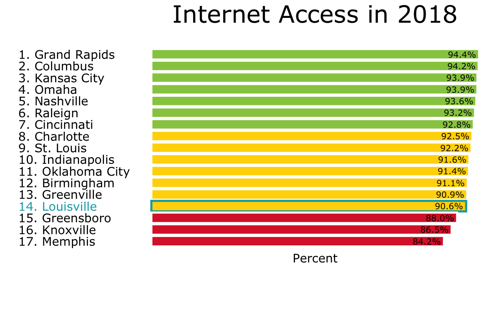
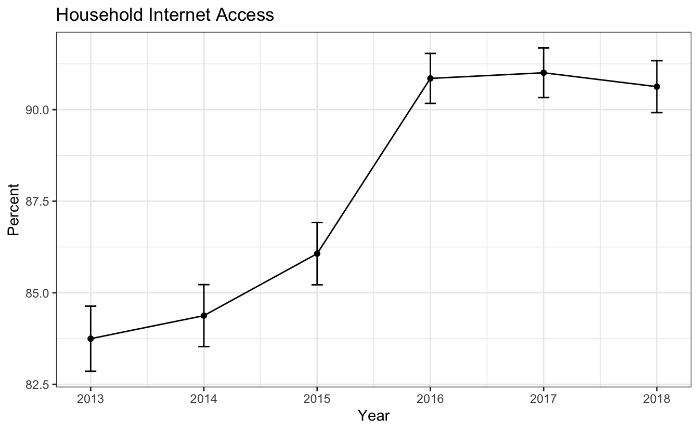
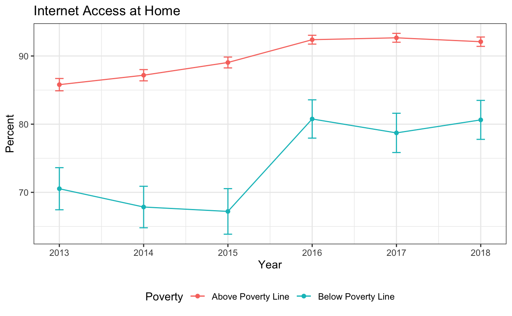
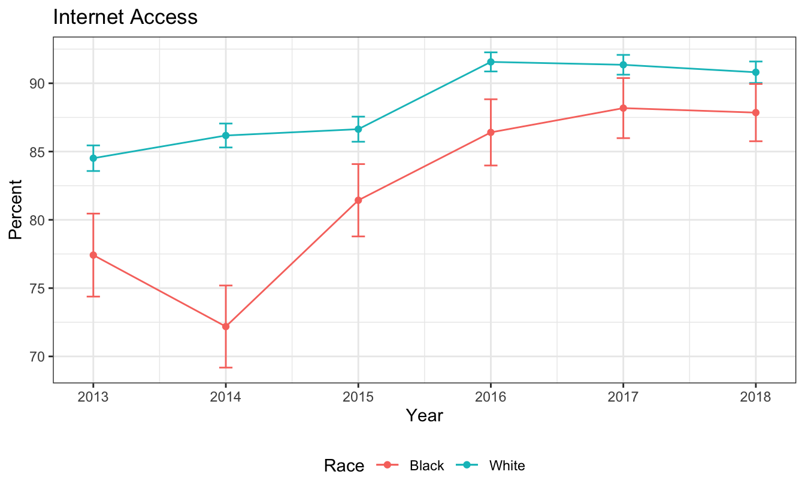
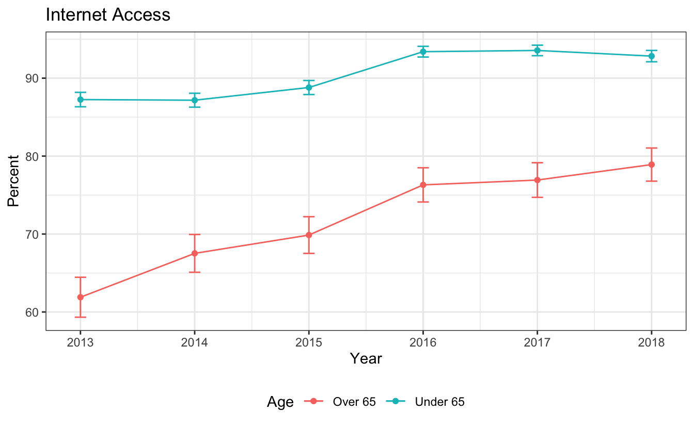

Overall
=======

This report uses census Microdata from IPUMS to look at internet access in the Louisville MSA. Data is available from 2013 to 2018. Louisville ranks towards the bottom of our peer cities in percent of people with home internet access, although the differences among the cities are relatively small (The top city, Grand Rapids, is only 4 percentage points ahead of Louisville).

History
=======

Louisville has increased its internet access over time, including a large jump in 2016. (We do not currently have an explanation for this jump, so if you know of something that happened in that time period let us know). In the past few years access has leveled off at just above 90 percent of the population

Poverty
=======

There is an access gap between poor and nonpoor individuals in having internet access at home, although this gap has shrunk a little as overall access has increased.

Race
====

We also see a gap between Black and White households although this has closed dramatically since 2014.

Age
===

Finally, we see an age related gap, as individuals over the age of 65 are much less likely to be in a household with internet access.

Devices
=======

-   80% of Louisville households have a computer in thier household, unlike internet access this is down a little bit from 2013 (82%).
-   69% have a tablet in their household.
-   85% have either a computer or a tablet.
-   89% of households have a smartphone.
-   94% have either a smartphone or internet access at home.

JCPS additional capacity
========================

As schools transitioned to being online, JCPS distibuted:

-   20,833 Chromebooks
-   517 Hotspots

This is not a large enough distribution to change our standing relative to peer cities, but it does increase internet access among JCPS students.

This blog was originally written for the [Greater Louisville Project](https://greaterlouisvilleproject.org/blog/internet-access/) and is being posted here to reach an additional audience. Please refer to the Greater Louisville Project [post](https://greaterlouisvilleproject.org/blog/internet-access/) when referencing this work.

