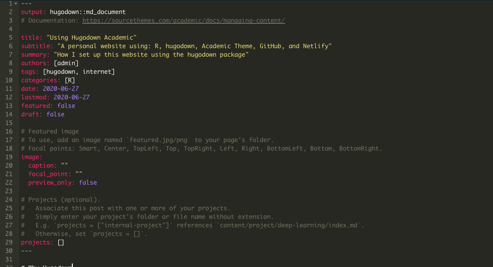
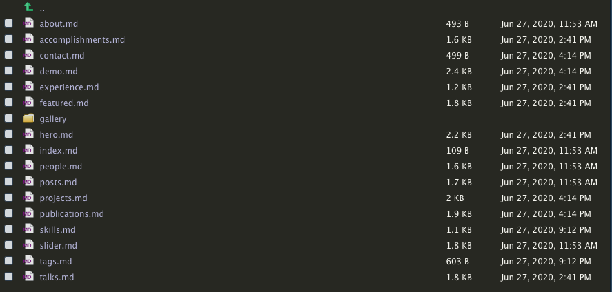
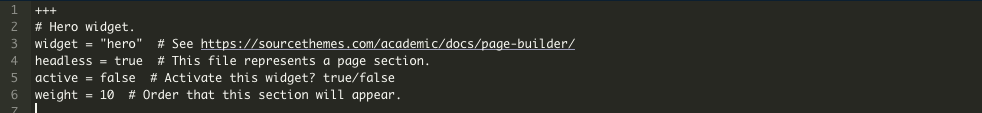
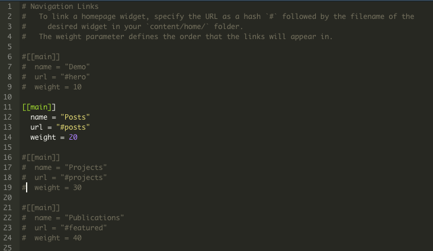

# Why Hugodown

I switched my website from blogdown + github pages to hugodown + netlify because `hugodown` more cleanly separates what R is doing and what Hugo is doing. Like blogdown, I still write posts in Rmarkdown - but then the post is knit to a markdown file designed to work with Hugo. The transformation takes place one post at a time instead of doing the whole site. It's still pretty early in using this, but so far I've found that cleanly separating those things out makes everything a bit easier for me to follow. I don't know how well `hugodown` works with themes other than Academic, but the Academic theme is quite flexible and makes sense for most people looking to share data science content. 

## Background knowledge

I'm assuming knowledge R as well as of git and Github (or Gitlab, etc.). I highly recommend [Happy Git with R](https://happygitwithr.com/) if you want to improve your version control skills. 

# Getting Started

I started at the [hugodown site](https://hugodown.r-lib.org/index.html) and installed hugodown

```{r, eval = FALSE}
devtools::install_github("r-lib/hugodown")
```

After install, I ran into two errors trying to create the site template.

1. I had not yet installed hugo. Thankfully, there was a really helpful error message that told me to install hugo, including the function from hugodown that would do it for me.
2. I needed to update `usethis` as I got `Error: 'ui_silence' is not an exported object from 'namespace:usethis'` the next time I tried to create the site. I installed the latest version of `usethis` from CRAN and it fixed the problem. You may want to also update `knitr` since I found I needed to do that when I first tried to knit a post. 

Once `usethis` and `knitr` are up to date you're ready to create and preview a site with the academic theme:

```{r, eval = FALSE}
# Install Hugo
hugodown::hugo_install('0.66.0') #I used this version because the error message suggested it

# Create academic site template
hugodown::create_site_academic()

# Preview site
hugodown::hugo_start()
```

# Making a new post

There's a lot of possible next steps from here to start customizing, but the first thing I wanted to do was make sure I could add new posts to the site. The `hugodown::use_post()` function generates a new folder and a .Rmd template for posting. The only slight confusion I ran into here was figuring out where to start my paths from. 

```{r, eval = FALSE}
#This errors with the directory not found
hugodown::use_post("content/post/using_hugodown")

#This works
hugodown::use_post("post/using_hugodown")
```

The folder will be called `using_hugodown` or whatever the name of your post is, while the .Rmd file will always be `index.Rmd`. The top of the file sets options for the post and is easy to fill out. The author field might be a bit confusing as the setup here allows multiple authors (which is great!) but the default author is `admin`. You can change this if you want when we get into how the academic theme is structured. 

There's also the very nice ability to set the post as a draft by marking `draft: true`. This allows you to save works in progress in the same file structure, which is really convenient. I also used this to get the sample posts to stop showing up while still having them saved in the same place for me to reference later. 



## Kniting a post

I'm not completely sure how up to date `knitr` needs to be, but I installed the latest version `knitr` from CRAN after I had an error of `Unknown extension: task_lists`. I also had to install the latest version of [pandoc](https://pandoc.org/installing.html), (I used the installer on the pandoc website) before I was able to knit without errors. 

Once able to knit it creates an `index.md` file that Hugo uses to create the site. If you open it and take a look you'll see some of the same configuration info at the top of the post as well as a bit of .html formatting inside the markdown. 

## Images

It took me a while to figure out how to include images in my post. Here again this is about figuring out the folder structure and also the just how important the initial `/` is in the file paths. There are two ways to deal with images.

First, you can put the image in the same folder as the post. For example, the above screenshot of the top of a hugodown post was generated with this code. The `top_of_hugodown.png` file is in the same folder as the `index.Rmd` file. It will not work unless you have a `./` in front of it. 

```

```

The second way to do this is to set up an images folder. My top level folder (the git repo and R project) is called `personal_site`, so the file path for this set up is `personal_site/static/img/top_of_hugodown.png`. I'll say more about the `static` folder when I get to customizing the Academic theme. But the way to include an image in this set up is to start the file path is if you're already in the `static` folder. 

```

```

Images that are generated by R code (e.g. ggplot graphs) are taken care of by `hugodown` which uses the first set up, although it creates a `figs` folder to hold the images inside the folder for the post. Not all htmlwidgets work with hugodown right now, so while there are no problems with ggplot images it's not currently possible to use plotly graphics. There may be some possible workarounds, but just be aware that anything in a post that creates an interactive graphic and uses javascript may run into conflicts with Hugo. 

# Customizing Academic

The Academic theme is so highly customizable that it starts out with a bewildering number of folders, files, and options. For the most part I was able to figure things out just by opening up files and reading the comments. There is also [documentation](https://sourcethemes.com/academic/docs/) online. 

## content/home

The first thing I did was work with the `content/home` folder and turn off some of the extra features. The folder looks like this:



If you open content/home/hero you'll be see this markdown at the top. I set active to false to get rid of the banner in the example site.  



I then went through and set almost everything to active = false except for about.md, index.md, posts.md, and skills.md. I'll come back later to start activating the sections I want to use as I have time to update, but for now I want to start with a more minimal site and then expand. 

Finally, just because these widgets are no longer active and on the home screen doesn't mean they don't show up in the menu across the top. That menu is controlled by `config/_default/menus.toml`, and you can comment out the sections you don't want



I also edited the skills.md file. I changed the weight to 100 to move it to the bottom of the page below the posts and then I had fun with icons and skill levels. I still don't completely understand how to tell which icon-pack a given icon from font awesome is in. I searched [font awesome](https://fontawesome.com/) for the icons I wanted to use and then just checked both `fab` and `fas`, although everything except the icons for R and Python were in `icon-pack = "fas"`.

## content/authors

In order to update from being Nelson Bighetti you need to look in `content/authors/admin`. By default the admin folder is linked, although if you add additional authors there is an option in `content/home/about.md` to change which author is displayed. 

I didn't change much of the structure here, so it was just a matter of overwritting the descriptions and the links in the `_index.md` folder. I also overwrote the `avatar.jpg` file with a picture of me. 

I uncommented the section for a CV and added my cv to `static/files/cv.pdf`. The `static` folder is used for files that aren't touched by Hugo in making the website, they're just hosted by the server and available as links for the rest of the site. This is what makes `static` a good place for .pdf files or for images if you choose that set up. (I suspect a possible workaround for interactive graphics is to place just the graphic in the static folder and then link to it from the post, although I haven't tried this yet).

## config.toml

There is a `config.toml` file in the main folder and here I added my site title, the web address, and a copyright notice. I also tried setting `enableGitInfo = true`, which allows the posts to automatically show when they were last updated on Github. The problem with this is that I copied over some posts from my old blog and it was then showing all of those as being written in a single day, so I disabled it. However, it would be a useful feature if you're only writing new posts.

## Google Analytics and Comments

In `config/_default/params.toml` there is a section for comments which allows you to set up either Disqus or Commento. The more difficult part here is setting up one of those services. Once set up all I had to do was enter my Disqus shortname and specify the engine option as 1 for Disqus. 

Similarly with Google Analytics once you get the tracking Id from Google Analytics it's painless to add it to the site. The same `params.toml` file has a marketing section at the very bottom with a  `google_analytics = " "` field where you can enter your tracking ID. 

# Deploying

I found the [deploy instructions](https://hugodown.r-lib.org/articles/deploy.html) provided with the hugodown package worked seemlessly, so no need to add to them here. 

The site checks from Github are set up automatically which is extremely nice, as is the ability to preview the site before merging in a pull request.


While it took some time to figure out where things are in the Hugo Academic template overall it seems like a good set up that will be easy both to maintain and to add to over time. 
